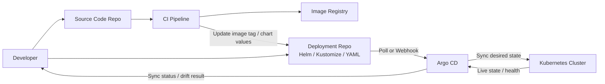

# Kubernetes Learning Notes

## Argo CD 與 GitOps

### Argo CD 是什麼

`Argo CD` 是一個跑在 Kubernetes 內的 `GitOps CD controller`。
它的核心想法不是「人手動把 YAML 套進 cluster」，而是：

- 先把想要的目標狀態放進 Git
- 讓 Git 成為單一事實來源
- 由 Argo CD 持續比對 Git 與 cluster 的差異
- 差異出現時，再由 Argo CD 去同步

所以 Argo CD 的重點不是單純「部署工具」，而是：

- 宣告式部署
- 版本可追蹤
- 狀態可比對
- 漂移可自動修正

### 你附圖在表達什麼

你附的圖其實是在講一個很典型的 GitOps 分工：

1. 開發者把應用程式原始碼推到 `Source Code Repo`
2. `CI Pipeline` 讀原始碼，建出映像檔，推到 `Images Registry`
3. 同時，部署設定放在另一個 `Deployment Repo`，裡面通常是 Helm、Kustomize、YAML
4. CI 或開發者會更新 Deployment Repo，例如把 image tag 改成新版本
5. `Argo CD` 持續監看 Deployment Repo
6. 一旦 Git 內的目標狀態改變，Argo CD 就把變更同步到 Kubernetes
7. 如果 cluster 內資源被手動改壞，Argo CD 也能偵測 drift，重新拉回 Git 裡定義的狀態

這張圖最重要的概念有兩個：

- `Source Repo` 和 `Deployment Repo` 可以分開
- 真正驅動部署的是 Git 中的宣告，而不是人直接在 cluster 上手改

### Argo CD GitOps 流程 Mermaid



### 為什麼會有兩個 Repo

實務上常把 repo 分成兩種：

- `Application repo`
  - 放原始碼
  - 放 Dockerfile
  - 放 CI 設定
- `GitOps repo`
  - 放 Helm chart
  - 放 values
  - 放 Kustomize overlay
  - 放 Argo CD `Application` YAML

這樣做的好處是：

- 原始碼變更和部署變更分開管理
- 可以清楚知道「哪次部署」到底改了什麼
- 維運與開發責任較容易切分
- 比較容易做審核與回滾

### Argo CD 在系統裡通常扮演什麼角色

Argo CD 不是拿來 build image 的，也不是拿來跑測試的。
它主要負責：

- 從 Git 讀取宣告式設定
- 解析 Helm / Kustomize / plain YAML
- 比對 cluster 現況與 Git 目標狀態
- 執行同步
- 呈現 `Sync` 與 `Health` 狀態
- 在啟用 `selfHeal` 時修正 drift
- 在啟用 `prune` 時刪掉 Git 已移除的舊資源

所以整體責任切分通常是：

- `CI` 負責 build、test、push image
- `Argo CD` 負責 deploy、sync、reconcile

### Argo CD 常見元件

- `argocd-server`
  - 提供 Web UI 與 API
- `argocd-repo-server`
  - 負責讀 Git repo、render Helm / Kustomize
- `argocd-application-controller`
  - 負責比對 desired state 與 live state，並執行 sync
- `Application`
  - Argo CD 管理單一部署目標的主要 CR
- `Project`
  - 用來限制 repo、namespace、cluster 等邊界

### Application 在實務上怎麼用

`Application` 可以理解成「一個部署單位」。
一個 Application 會描述：

- Repo 在哪裡
- 要抓哪個 branch / revision
- 要用哪個 path、chart、或 kustomization
- 要部署到哪個 cluster
- 要部署到哪個 namespace
- 要不要自動同步

例如：

- 一個 team 的 web service 是一個 Application
- 一個第三方 Helm chart 也是一個 Application
- 一個觀測系統 stack 也可以是一個 Application

### Argo CD 與 Helm 的關係

Argo CD 本身不是 Helm registry，也不是 Helm package manager。
它比較像：

- 讀取 Helm chart
- 代你 render 成 Kubernetes manifests
- 再把結果套用到 cluster

所以 Helm 在 Argo CD 裡常見的來源有兩種：

1. `Git repo 裡的 chart path`
2. `外部 Helm repo / OCI registry`

這也是你這題 Task10 會同時練到的兩條路：

- `Task6` 用 GitLab repo 內的 chart path
- 第三方服務用公開 Helm repo

### Argo CD 與 Kustomize 的關係

Kustomize 和 Helm 一樣，都是 Argo CD 支援的宣告來源。
差別大致上是：

- `Helm`
  - 擅長參數化
  - 適合做 reusable chart
- `Kustomize`
  - 擅長 overlay
  - 適合同一套 base 對不同環境做差異化

如果你只有少量環境差異，Kustomize 常很直覺。
如果你要做較多參數化、或要對外重複發佈，Helm 會比較合適。

### Sync、Prune、Self Heal 是什麼

- `Sync`
  - 把 Git 中的目標狀態套進 cluster
- `Prune`
  - 如果某個資源已經從 Git 移除，Argo CD 同步時也把 cluster 內的舊資源刪掉
- `Self Heal`
  - 如果有人手動改動 cluster 內資源，Argo CD 會把它修回 Git 中定義的樣子

這三個功能合起來，才是 GitOps 真正穩定的原因。

### Drift 是什麼

`Drift` 指的是：

- Git 裡定義的期望狀態
- 和 cluster 裡實際狀態

兩者不一致。

例如：

- Git 裡 replicas 是 `2`
- 但有人手動 `kubectl scale` 成 `5`

這時 Argo CD 會顯示 `OutOfSync`。
若啟用 `selfHeal`，它會把 replicas 拉回 `2`。

### 實務上常見工作流

最常見的工作流通常是：

1. 開發者修改 app code
2. CI 測試並建 image
3. CI 把 image push 到 registry
4. CI 或開發者更新 GitOps repo 內的 image tag / values
5. Argo CD 偵測到 GitOps repo 變更
6. Argo CD 同步到 cluster
7. 團隊在 UI 上檢查 `Sync` 與 `Health`

若要回滾，通常不是直接去 cluster 改，而是：

- 回滾 Git commit
- 或把 chart / values 改回舊版
- 再交給 Argo CD 重同步

### 實務上為什麼喜歡用 Argo CD

- 所有部署變更都有 Git 歷史
- 發生問題時容易比對是 image 變了，還是 values 變了
- 避免人工在 cluster 上熱修後沒人知道
- 可以把部署流程標準化
- UI 對教學和排錯很直觀

### 實務上要注意的地方

- 不要把敏感資訊直接明文放進 Git
  - 應搭配 External Secrets、Sealed Secrets、Vault 等方式
- private repo 需要憑證或 token
- Helm chart 與 image tag 要有版本策略
- `prune` 很方便，但也要小心誤刪
- 多團隊環境要配合 `Project` 做邊界控管

### App of Apps 是什麼

`App of Apps` 是指：

- 用一個根 `Application`
- 去管理其他子 `Application`

它的好處是：

- 可以把整個 cluster 的基礎元件收斂成一個入口
- 新環境 bootstrap 很快
- Application 本身也能 GitOps 化

在你這題裡，做法就是：

- 先有 `task6-platform` 和 `third-party-nginx` 兩個 Application
- 再做一個 `task10-root`
- 讓 `task10-root` 去指向存放 `apps/` 的 Git 路徑

### Task10 這題對應到 Argo CD 的哪裡

這題其實把 Argo CD 的核心場景都串起來了：

1. 你先在 GitLab 建一個 GitOps repo
2. 把 `Task6` 的 Helm chart push 上去
3. Argo CD 先手動建立一個指向 GitLab chart path 的 Application
4. 再手動建立一個指向公開 Helm repo 的第三方 Application
5. 最後把這兩個 Application 也改成 YAML 放回 Git
6. 再進一步用 App of Apps 管理它們

這是一條很完整的 GitOps 練習路線，因為它同時包含：

- Git repo 當 source of truth
- Helm chart 部署
- 第三方 Helm chart 部署
- Application CR 管理
- App of Apps bootstrap

## Finalizer

`finalizer` 可以把它想成 Kubernetes 資源刪除前的清場註記。

當你執行 `kubectl delete` 時，Kubernetes 不一定會立刻把物件刪掉。若資源的 `metadata.finalizers` 有值，API Server 會先把資源標記為「正在刪除」：

- 寫入 `deletionTimestamp`
- 保留資源本體
- 等待對應 controller 完成善後

只有當 finalizer 被移除後，Kubernetes 才會真正刪掉該資源。

### 為什麼會卡在 Terminating

如果資源上有 finalizer，但負責收尾的 controller 已經不存在，資源就可能永遠卡在 `Terminating`。

典型現象：

- `kubectl get ... -o yaml` 看得到 `deletionTimestamp`
- `finalizers` 仍然存在
- 相關相依物件其實已經不在了
- 但資源就是不會消失

這不是 API Server 壞掉，而是：

- API Server 只負責記錄「要刪」
- 真正的清場邏輯要由 controller 執行
- controller 不在時，沒有人會移除 finalizer

### 什麼時候可以手動移除 finalizer

當你已經確認：

- 相依資源都刪掉了
- 對應 controller 已不在，無法自動收尾
- 留著只會一直卡住

這時可以手動 patch finalizer：

```powershell
kubectl patch <resource> <name> --type=merge -p '{\"metadata\":{\"finalizers\":[]}}'
```

這是在告訴 Kubernetes：

- 不再等待外部 controller 收尾
- 直接完成刪除流程

## Controller

Kubernetes 不是一個單一中央大腦，而是：

- API Server：接收與提供資源資料
- etcd：儲存資源狀態
- controllers：持續觀察資源，讓現實狀態靠近你宣告的理想狀態

可以把 controller 想成：

- 持續巡邏的自動管理員
- 負責某一類資源
- 發現實際狀態不符合宣告時，就自動修正

### 為什麼 Kubernetes 不自己清 finalizer

因為 API Server 並不知道外部善後邏輯。

例如：

- 某個 `Service type=LoadBalancer` 背後可能有外部雲端 Load Balancer
- 某個 `Gateway` 背後可能有 Envoy Deployment、Service 與動態設定
- 某個自訂 CRD 可能代表外部資料庫、DNS 或憑證

這些善後步驟只有對應 controller 才知道怎麼做，所以 finalizer 必須等 controller 來移除。

## 常見 Controllers

### Deployment controller

負責維持 Deployment 想要的 Pod 數量與版本。

例如你宣告：

```yaml
replicas: 3
```

如果實際只有 2 個 Pod，Deployment controller 會補 1 個。  
如果 rollout 更新 image，它也會按照策略建立新 ReplicaSet、逐步替換舊 Pod。

### StatefulSet controller

負責管理有身份與順序性的 Pod。

特色：

- Pod 名稱固定，例如 `mysql-0`、`mysql-1`
- 建立與刪除通常有順序
- 常搭配 PVC 使用

這也是為什麼 StatefulSet 的資料卷不一定會隨著 Pod 一起被刪除，因為它通常被視為需要保留的狀態資料。

### ingress-nginx controller

這是 Ingress 的實作者之一。

它負責：

- 監看 `Ingress`
- 讀取 `IngressClass`
- 產生與更新 NGINX 設定
- 把流量依照 host/path 規則轉送到正確的 Service

在 task8 裡它扮演的是：

- 入口流量控制器
- 依照 `Host: grafana.task8.local` 把請求轉到 Grafana Service

## Ingress / IngressClass / ingress-nginx controller 對照

### Ingress 是什麼

`Ingress` 是流量規則本身。

它描述：

- 哪個 hostname
- 哪個 path
- 要轉到哪個 Service

但它自己不會真的處理流量，它只是宣告規則。

例如：

```yaml
apiVersion: networking.k8s.io/v1
kind: Ingress
spec:
  ingressClassName: nginx
  rules:
    - host: grafana.task8.local
      http:
        paths:
          - path: /
            pathType: Prefix
            backend:
              service:
                name: grafana
                port:
                  number: 80
```

這代表：

- 當請求 host 是 `grafana.task8.local`
- 就轉送到 `service/grafana:80`

### IngressClass 是什麼

`IngressClass` 是派工資訊。

它描述：

- 這一類 Ingress 應該由哪個 Ingress Controller 處理

例如：

```yaml
apiVersion: networking.k8s.io/v1
kind: IngressClass
metadata:
  name: nginx
spec:
  controller: k8s.io/ingress-nginx
```

這代表：

- 名叫 `nginx` 的 class
- 對應 `ingress-nginx` controller

所以當某個 Ingress 寫：

```yaml
spec:
  ingressClassName: nginx
```

它就是在說：

- 這份流量規則要交給 `nginx` 這個 class 對應的 controller 處理

### ingress-nginx controller 是什麼

`ingress-nginx controller` 才是真正執行流量轉送的人。

它會監看：

- `Ingress`
- `IngressClass`
- `Service`
- `EndpointSlice`
- `Secret`

然後把規則翻譯成 NGINX 設定，讓 NGINX 真的幫你轉發流量。

### 三者關係

可以用一句話記：

- `Ingress` 決定「怎麼轉」
- `IngressClass` 決定「誰來做」
- `controller` 負責「真的去做」

### ingress-nginx chart 裡兩個容易混淆的設定

#### `controller.ingressClassResource.name`

這是在說：

- Helm 安裝時，要建立的 `IngressClass` 物件名稱是什麼

例如：

```yaml
controller:
  ingressClassResource:
    name: nginx
```

通常會建立出：

- `IngressClass/nginx`

所以它比較偏向「建立哪個 class 資源」。

#### `controller.ingressClass`

這是在說：

- 這個 `ingress-nginx controller` 自己要接手哪個 class 名稱

例如：

```yaml
controller:
  ingressClass: nginx
```

意思是：

- controller 看到 `ingressClassName: nginx` 的 Ingress，就會接手處理

所以它比較偏向「controller 自己認得哪個 class」。

### 為什麼兩者通常設成一樣

最常見做法是：

```yaml
controller:
  ingressClassResource:
    name: nginx
  ingressClass: nginx
```

這樣整條鏈會對得很直觀：

- 叢集裡建立 `IngressClass/nginx`
- controller 也宣告自己處理 `nginx`
- 你的 Ingress 再寫 `ingressClassName: nginx`

三者自然就接起來了。

### `watchIngressWithoutClass: false` 的意思

這代表：

- controller 不會接手那些沒有指定 `ingressClassName` 的 Ingress

好處是：

- 規則更明確
- 不容易誤接到別的 Ingress
- 在學習時比較容易理解資源是怎麼對上的

### Envoy Gateway controller

這是 Gateway API 的實作者之一。

它負責：

- 監看 `GatewayClass`、`Gateway`、`HTTPRoute`
- 驗證哪些 Gateway 應該由它管理
- 建立對應的 Envoy data plane Deployment / Service
- 把 Gateway API 規則翻譯成 Envoy 可執行的流量設定

在 task8 裡它扮演的是：

- Gateway API 的控制器
- 接手 `GatewayClass eg`
- 根據 `Gateway` / `HTTPRoute` 建出對外服務與路由規則

## Gateway API 與 Ingress 的對照

在這次 task8 裡，可以先用這個方式理解：

- `Ingress`
  - 較早期、較精簡的 HTTP/HTTPS 入口規則 API
- `Gateway API`
  - 較新、分工更清楚、可擴充性更高的入口 API

學習上可以先做這個粗略對照：

- `IngressClass`
  - 類似 Gateway API 裡的 `GatewayClass`
- `Ingress`
  - 概念上可拆成 `Gateway` + `HTTPRoute`
- `ingress-nginx controller`
  - 類似 Envoy Gateway controller

### 三個核心物件

#### `GatewayClass`

定義：

- 哪一種 Gateway controller 會接手這類 Gateway

它很像在說：

- 這個入口類型由誰來實作

#### `Gateway`

定義：

- 入口本身長什麼樣

例如：

- 開哪些 listener
- 用哪個 port
- 接哪些 hostname

可以把它想成：

- 入口設備或入口站點本身

#### `HTTPRoute`

定義：

- HTTP 流量怎麼轉送

例如：

- 某個 hostname
- 某個 path
- 要送到哪個 Service

可以把它想成：

- 真正的 HTTP 路由規則

### 這次 task8 的對應方式

Ingress 版本：

- `IngressClass/nginx`
- `Ingress`
- `ingress-nginx controller`

Gateway API 版本：

- `GatewayClass/eg`
- `Gateway`
- `HTTPRoute`
- `Envoy Gateway controller`

### 一句話記法

- `Ingress` 比較像把入口與路由規則放在同一個物件裡
- `Gateway API` 則把入口能力與路由規則拆開
- 所以 Gateway API 在中大型場景通常更清楚、更好擴充

## Task8 Cleanup 順序學到的事

若要避免卡 finalizer，理想順序通常是：

1. 刪除高階路由資源，例如 `HTTPRoute`
2. 刪除 `Gateway`
3. 刪除 `GatewayClass`
4. 確認不再有相依資源
5. 最後才卸載 controller

如果先把 controller 卸載掉，再刪還帶 finalizer 的資源，就可能需要手動 patch 才能解卡。

## Task9 Loki

`Loki` 是 log aggregation backend，重點不是全文索引，而是把 log 依 labels 分流、儲存、查詢。

- 可以把它想成專門收 log 的後端
- collector 把 log push 到 Loki
- Grafana 再把 Loki 當作 datasource 查詢
- 這題會用 `LogQL` 在 Loki 裡找 Nginx access log

### Task9 裡 Loki 的重點設定

- `deploymentMode: SingleBinary`
  適合 Minikube 單節點 lab
- `loki.commonConfig.replication_factor: 1`
  單節點不需要多副本複寫
- `loki.storage.type: filesystem`
  這題先用檔案系統，不接物件儲存
- `loki.schemaConfig`
  定義 Loki index / chunk 使用的 schema。這次使用 `tsdb + v13`
- `singleBinary.persistence.enabled: true`
  這次實測如果 `/var/loki` 不可寫，Loki 會因為 `read-only file system` 啟動失敗
- `chunksCache.enabled: false`、`resultsCache.enabled: false`
  關掉額外 cache 元件，降低 lab 複雜度
- `lokiCanary.enabled: false`
  先不加 canary，避免多出和題目無關的 log source

## Task9 Grafana

`Grafana` 是查詢與視覺化入口，本身不是 log storage。

- Grafana 會連 datasource
- Grafana 會把 Loki 的 log 顯示在 Explore 或 dashboard
- 如果 Grafana 壞掉，不代表 Loki 沒收 log
- 如果 Loki 壞掉，Grafana UI 仍可能能登入，但查 log 會失敗

### Task9 裡 Grafana 的重點設定

- `service.type: ClusterIP`
  先維持叢集內服務，用 `port-forward` 驗證即可
- `service.port: 80`
  對外簡化成 80，內部仍轉到 3000
- `persistence.enabled: false`
  這題先不追求 Grafana 本身持久化
- `datasources.datasources.yaml`
  啟動時自動 provision Loki datasource
- `url: http://loki-gateway.task9.svc.cluster.local`
  Grafana 透過 Service 找 Loki，不直接依賴 Pod IP

## Loki 與 Grafana 的依存關係

這兩者是後端與前端的關係，不是平行獨立。

- `Loki = 存 log、查 log 的後端`
- `Grafana = 看 log、查 log 的前端`
- Grafana 依賴 Loki 當 datasource 才能查這題的 logs
- Loki 不依賴 Grafana 才能收 log

所以排錯時可以這樣想：

- Grafana 登得進去但看不到 log：先檢查 Loki 與 collector
- Loki 正常但 Grafana 打不開：代表收 log 這段可能沒問題，只是視覺化入口壞掉

## Logging Pipeline 名詞

`logging pipeline` 就是 log 從產生到被查詢的整條路徑。

### Log Producer

產生日誌的應用程式。

- 這題裡是 `nginx`
- Nginx 收到 request 後把 access log 寫進檔案

### HostPath

把 node 上的真實路徑掛進 Pod。

- 這題把 node 的 `/var/log/task9-nginx` 掛進 Nginx
- collector 也掛進同一個 hostPath
- 所以兩個 Pod 看到的是同一份節點檔案

### Log Collector

負責讀 log、加 metadata、送往後端的元件。

- 常見有 `Fluent Bit`、`Fluentd`、`Logstash`
- 以前 Loki 常配 `Promtail`
- 這題選 `Fluent Bit`

### DaemonSet

確保每個 node 都有一份 Pod。

- log collector 很常用 DaemonSet
- 因為每個 node 都可能有應用在本地寫 log
- 每個 node 都放一個 collector，才能在本地讀檔再往外送

### Stream Labels

Loki 用 labels 區分 log stream。

- 例如 `job=task9-nginx`
- 查詢時常用 `{job="task9-nginx"}`
- labels 是 Loki 查詢的核心概念

### Push

collector 主動把 log 傳給 Loki。

- 這題是 `Fluent Bit -> Loki`
- 目標 API 是 `/loki/api/v1/push`

### Datasource

Grafana 連後端資料系統的設定。

- 這題的 datasource 是 `Loki`
- datasource 設好後，Grafana Explore 才能查 logs

### Explore

Grafana 裡用來即時查 logs 的介面。

- 這題驗證成功時，應該能在 Explore 查到 `{job="task9-nginx"}` 的結果

## Task9 資料流

1. 使用者打到 Nginx
2. Nginx 把 access log 寫到 `hostPath`
3. Fluent Bit DaemonSet 讀取 `hostPath` 裡的 log 檔
4. Fluent Bit 把 log push 到 Loki
5. Grafana 透過 Loki datasource 查詢
6. 你在 Grafana Explore 看到 log

## Task9 為什麼不用 Promtail

Grafana 官方文件說明：

- Promtail 在 2025-02-13 進入 LTS
- Promtail 在 2026-03-02 進入 EOL

今天是 2026-03-30，所以這次 lab 不再把 Promtail 當首選，改用目前仍維護中的 `Fluent Bit`。
