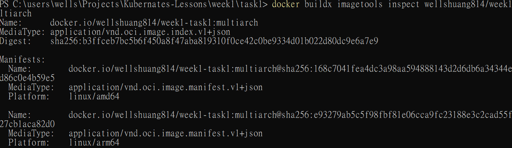
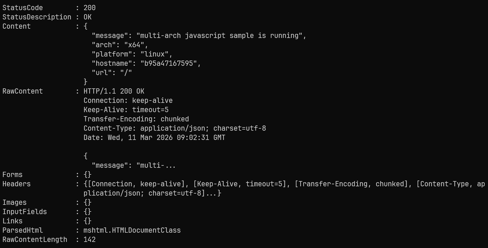

## Dockerfile 優化

1. 以下為一份 TypeScript 的 Dockerfile，請說明有哪些方向可以優化此 Dockerfile。
```dockerfile
FROM node:20
WORKDIR /app
COPY package*.json ./
RUN npm install
COPY tsconfig.json ./
COPY src ./src
RUN npm run build
EXPOSE 3000
CMD ["node", "dist/index.js"]
```

Ans:

1. 使用多階段建構 (Multi-stage builds)

第一階段只負責安裝完整依賴並編譯 TypeScript。第二階段只保留執行需要的內容。這樣做的好處是：

最終 image 更小

不會把 TypeScript 原始碼一起帶進正式環境

不會把 build tool 和 devDependencies 留在 production image 裡

Build Stage
```
FROM node:20-slim AS builder

WORKDIR /app

COPY package*.json ./
RUN npm ci

COPY tsconfig.json ./
COPY src ./src

RUN npm run build
```

Runner Stage
```
FROM node:20-slim AS runner

WORKDIR /app

ENV NODE_ENV=production

COPY package*.json ./
RUN npm ci --omit=dev

COPY --from=builder /app/dist ./dist

USER node

EXPOSE 3000

CMD ["node", "dist/index.js"]
```

2. 使用更精簡的 base image

使用 node:20-slim 代替 node:20，可以減少 image 大小。

3. 使用 npm ci 代替 npm install

npm ci 會使用 package-lock.json 來精準安裝依賴，確保安裝的依賴版本與開發時一致，避免因為版本飄動造成不穩定。

4. 使用 --omit=dev 來安裝依賴

npm ci --omit=dev 只會安裝 production 依賴，只保留正式執行需要的套件，避免把 TypeScript、測試工具、eslint 之類的東西裝進最後的 image。

5. 提高 Docker layer cache 命中率

將 package*.json 放在 COPY 之前，可以確保在修改程式碼時，如果 package*.json 沒有變動，Docker 可以沿用之前的 layer，避免重新安裝依賴。

6. 使用 .dockerignore

使用 .dockerignore 可以避免把不需要的檔案一起 COPY 進 image，可以減少 image 大小。


## 使用buildx編譯多架構image

2. 嘗試使用 buildx 將 dockerfile（不需要是這一份，可以請 AI 根據你的習慣語言生一個範例） 編譯成多架構的 image，Image 需要可以分別在 x86 跟 ARM 上執行。
完成後請嘗試驗證是否有成功執行（可以開雲端 VM 執行看看）。

Ans:

以下改用一個可直接執行的 JavaScript 範例來示範。`Dockerfile` 會把 `server.js` 包進 image，程式啟動後會回傳目前容器執行所在的 CPU 架構，方便驗證同一個 tag 是否真的可在 `x86_64` 與 `ARM64` 上執行。

範例 Dockerfile：

```dockerfile
FROM --platform=$TARGETPLATFORM node:20-slim

WORKDIR /app

ENV NODE_ENV=production
ENV PORT=3000

COPY server.js ./

EXPOSE 3000

CMD ["node", "server.js"]
```

範例程式：

```javascript
const http = require("http");
const os = require("os");

const port = Number(process.env.PORT || 3000);

const server = http.createServer((req, res) => {
  const body = {
    message: "multi-arch javascript sample is running",
    arch: process.arch,
    platform: process.platform,
    hostname: os.hostname(),
    url: req.url,
  };

  res.writeHead(200, { "Content-Type": "application/json; charset=utf-8" });
  res.end(JSON.stringify(body, null, 2));
});

server.listen(port, "0.0.0.0", () => {
  console.log(`Server listening on port ${port}`);
});
```

多架構建置步驟：

1. 建立並啟用 buildx builder。

```bash
docker buildx create --name week1-multiarch --driver docker-container --use
docker buildx inspect --bootstrap
```

2. 登入你的 image registry，例如 Docker Hub。

```bash
docker login
```

3. 建置並推送同時支援 `linux/amd64` 與 `linux/arm64` 的 manifest。

```bash
docker buildx build \
  --platform linux/amd64,linux/arm64 \
  -t <你的帳號>/week1-task0:multiarch \
  --push \
  week1/task0
```

4. 檢查 manifest 是否真的包含兩種架構。

```bash
docker buildx imagetools inspect <你的帳號>/week1-task0:multiarch
```

如果成功，輸出中應該看得到至少：

```text
linux/amd64
linux/arm64
```

如何驗證 image 真的能執行：

方法一：在兩台不同架構的雲端 VM 驗證

1. 準備兩台 Linux VM。
   一台使用 `x86_64 / amd64`。
   一台使用 `ARM64 / aarch64`。

2. 在兩台 VM 都安裝 Docker，然後分別執行：

```bash
docker run --rm -p 3000:3000 <你的帳號>/week1-task0:multiarch
```

3. 另外開一個 terminal 呼叫：

```bash
curl http://127.0.0.1:3000
```

4. 驗證回傳內容。
   在 x86 VM，`arch` 預期是 `x64`。
   在 ARM VM，`arch` 預期是 `arm64`。

預期會看到類似：

```json
{
  "message": "multi-arch javascript sample is running",
  "arch": "arm64",
  "platform": "linux",
  "hostname": "vm-name",
  "url": "/"
}
```

方法二：在同一台支援 Docker 的主機上做 manifest 驗證

1. 先確認 manifest：

```bash
docker buildx imagetools inspect <你的帳號>/week1-task0:multiarch
```

2. 若主機本身是 x86，直接執行：

```bash
docker run --rm -p 3000:3000 <你的帳號>/week1-task0:multiarch
```

3. 若主機本身是 ARM，執行同一條指令即可，Docker 會自動拉取相符架構的 image。

補充：

- 多架構 image 通常要用 `--push` 推到 registry，因為 `--load` 一次只能載入單一平台到本機 Docker。
- 這個範例沒有安裝任何原生編譯套件，因此很適合拿來示範 `amd64` 與 `arm64` 共用同一份 Dockerfile。
- 若要交作業，可以附上 `docker buildx imagetools inspect` 的結果截圖，以及兩台 VM 的 `curl` 回傳結果截圖。

實際驗證結果：

1. 本機 x64 環境已成功執行容器，HTTP 回應內容中的 `arch` 為 `x64`，表示 Docker 已拉取並執行 `linux/amd64` 版本的 image。



2. 使用 `docker buildx imagetools inspect <你的帳號>/week1-task0:multiarch` 檢查 manifest，可看到至少包含 `linux/amd64` 與 `linux/arm64` 兩種平台，代表此 tag 已發佈為多架構 image。



3. 後續若要補齊 ARM 實機驗證，可在 ARM64 Linux VM 上直接執行同一個 tag，並以 `curl http://127.0.0.1:3000` 確認回傳 `arch: "arm64"`。

