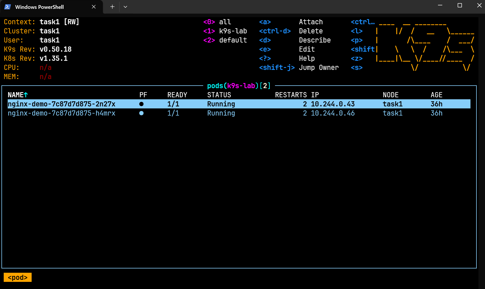
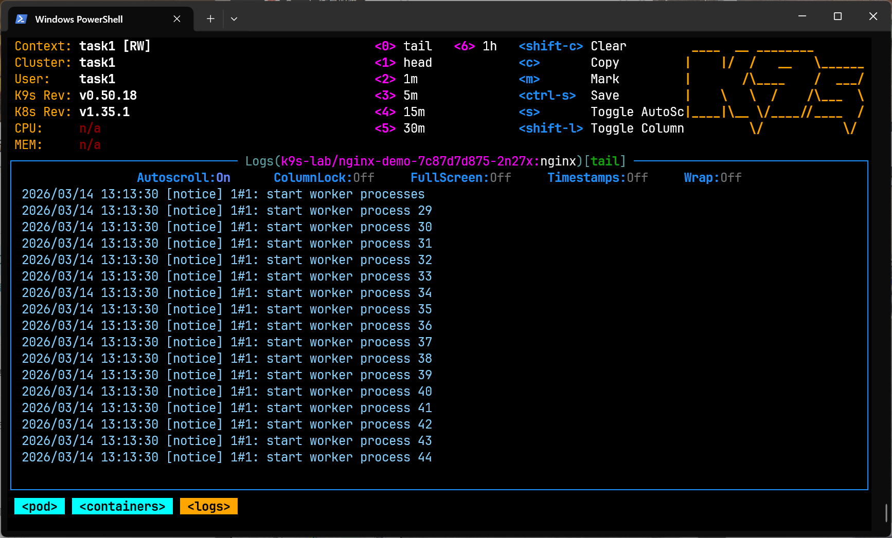
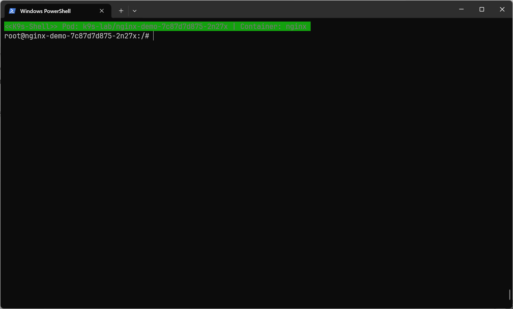
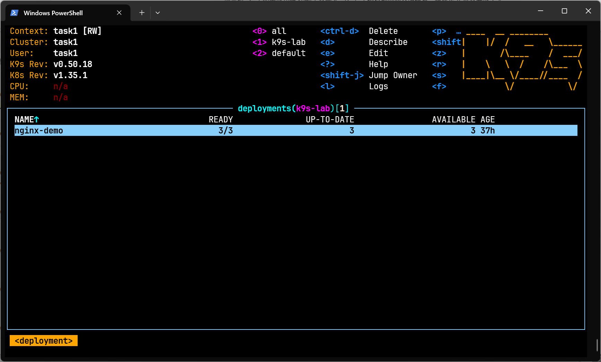
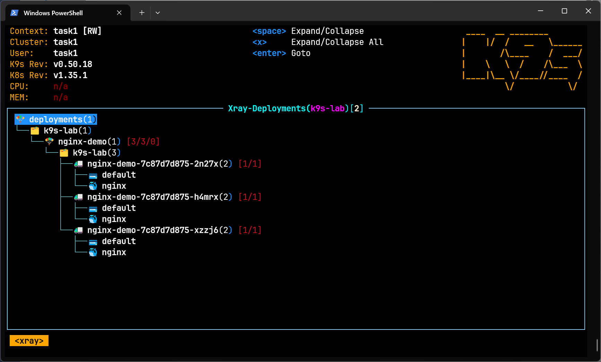

# Week1 Task2: K9s 練習實作紀錄

這份文件整理 `week1/task2` 的實際操作過程、畫面截圖、最終結果與過程中遇到的問題，作為本題作業報告。

官方指令文件：
[K9s Commands](https://k9scli.io/topics/commands/)

## 題目目標

本題的目標是熟悉 K9s 的基本操作，包含：

1. 啟動 K9s 並操作 Kubernetes 資源
2. 切換到指定 namespace
3. 查看 Pod logs
4. 進入容器 shell 查看檔案系統
5. 編輯 Deployment 的 replicas
6. 使用 XRay 檢視 Deployment 與相關資源的關係

## 練習環境

- Kubernetes: Minikube (`task1` profile)
- Driver: Docker
- 練習 namespace: `k9s-lab`
- 練習資源:
  - `deployment/nginx-demo`
  - `service/nginx-demo-service`

建立練習資源所使用的指令如下：

```powershell
minikube start -p task1 --driver=docker
kubectl apply -f week1/task2/namespace.yaml
kubectl apply -f week1/task2/deployment.yaml
kubectl apply -f week1/task2/service.yaml
kubectl get all -n k9s-lab
```

## 實際操作紀錄

### 1. 啟動 K9s 並進入 `k9s-lab` 的 Pod 畫面

先啟動 K9s：

```powershell
k9s
```

本次實作時，K9s `v0.50.18` 在這台 Windows 環境中，`:ns`、`:pod`、`:pods` 等 command 解析出現異常，直接輸入會顯示 `command not found`。因此本次改用等效方式處理：

```powershell
kubectl config set-context --current --namespace=k9s-lab
k9s
```

之後在 K9s 中進入 `task1` context，並切到 `k9s-lab` 的 Pod 畫面。



### 2. 觀察 nginx Pod logs

在 Pod 畫面選取一個 `nginx-demo` pod，按 `l` 進入 logs 畫面，即可看到 Nginx 容器輸出的日誌。

這一步確認了 Pod 正常運作，且 K9s 能正確讀取容器 logs。



### 3. 進入容器 shell 並查看檔案系統

在同一個 Pod 上按 `s` 進入容器 shell，接著執行：

```sh
ls /
```

可以成功進入 Nginx 容器內部，並查看容器根目錄的檔案系統結構，完成本題要求的 shell 操作。



### 4. 編輯 Deployment replicas，將 2 改為 3

切換到 Deployment 畫面後，選取 `nginx-demo`，按 `e` 編輯資源，將：

```yaml
replicas: 2
```

改為：

```yaml
replicas: 3
```

存檔離開後，K9s 顯示 Deployment 變為 `3/3`，表示副本數已成功更新，且新 Pod 已建立完成。



### 5. 使用 XRay 檢視 Deployment 與相關資源關係

最後進入 XRay 檢視，查看 `nginx-demo` Deployment 與其底下 Pods 之間的關係。

本次實作在 K9s 中成功進入 `Xray-Deployments(k9s-lab)` 畫面，觀察到 `nginx-demo` 已連結到 3 個 Pod，符合前一步將 replicas 調整為 3 的結果。



## 最終結果

實作完成後，`k9s-lab` 中的資源狀態如下：

```powershell
kubectl get all -n k9s-lab
```

實際結果：

```text
NAME                              READY   STATUS    RESTARTS      AGE
pod/nginx-demo-7c87d7d875-2n27x   1/1     Running   2 (45m ago)   37h
pod/nginx-demo-7c87d7d875-h4mrx   1/1     Running   2 (45m ago)   37h
pod/nginx-demo-7c87d7d875-xzzj6   1/1     Running   0             5m11s

NAME                         TYPE        CLUSTER-IP      EXTERNAL-IP   PORT(S)   AGE
service/nginx-demo-service   ClusterIP   10.108.74.235   <none>        80/TCP    37h

NAME                         READY   UP-TO-DATE   AVAILABLE   AGE
deployment.apps/nginx-demo   3/3     3            3           37h

NAME                                    DESIRED   CURRENT   READY   AGE
replicaset.apps/nginx-demo-7c87d7d875   3         3         3       37h
```

另外，Deployment 狀態也確認為：

```powershell
kubectl get deployment nginx-demo -n k9s-lab -o wide
```

```text
NAME         READY   UP-TO-DATE   AVAILABLE   AGE   CONTAINERS   IMAGES         SELECTOR
nginx-demo   3/3     3            3           37h   nginx        nginx:1.27.5   app=nginx-demo
```

## 過程中遇到的問題與處理方式

### 1. `:ns` / `:pod` / `:pods` 在 K9s 中顯示 `command not found`

本次在 `K9s v0.50.18` 的實機操作中，使用官方文件中的部分 command 時，出現 `command not found` 的情況，因此未能完全按照題目原始指定的 `:ns` 操作。

為了完成同樣的學習目標，本次改採以下等效方式：

```powershell
kubectl config set-context --current --namespace=k9s-lab
```

再重新進入 K9s，達到切換 namespace 的相同效果。

### 2. Docker Desktop / Minikube 中途掉線

操作過程中曾遇到 Docker engine 未連線，導致：

- K9s 左上角顯示 `K8s Rev: n/a`
- K9s 只剩 `contexts` / `aliases` 可瀏覽
- `kubectl` 無法連上 API Server

後續透過重新啟動 Docker Desktop，並重新執行：

```powershell
minikube start -p task1 --driver=docker
```

使 Minikube 與 K9s 恢復正常連線。

## 結論

本題已完成以下操作：

1. 成功啟動 K9s
2. 成功切換到 `k9s-lab` namespace
3. 成功查看 nginx pod logs
4. 成功進入容器 shell 並執行 `ls /`
5. 成功將 `nginx-demo` Deployment 的 replicas 從 `2` 更新為 `3`
6. 成功使用 XRay 檢視 Deployment 與 Pod 的關係圖

雖然過程中遇到 K9s command 解析異常與 Docker/Minikube 連線中斷，但最終仍完成本題要求，並透過 K9s 熟悉了 logs、shell、edit 與 xray 等核心操作。