# Week1 Task4

本題示範如何讓 Pod 透過 `ServiceAccount` 搭配 `RBAC` 權限，安全地呼叫 Kubernetes API，讀取指定 namespace 的 Pod 清單，並把結果輸出到 Pod logs。

這份 `README.md` 使用 UTF-8 編碼。

## 題目要求

1. 參考 ServiceAccount 與 Pod 設定相關官方文件
2. 使用任一程式語言撰寫程式，呼叫 Kubernetes API 取得指定 namespace 的 Pod 列表
3. 將程式打包成 image
4. 使用 Projected Volume 掛載 ServiceAccount token
5. 最終可在 Pod logs 中看到類似 `kubectl get pods` 的結果
6. 將 image push 到 public Docker Hub registry

## 參考文件

- [Configure Service Accounts for Pods](https://kubernetes.io/docs/tasks/configure-pod-container/configure-service-account/)
- [Service Accounts](https://kubernetes.io/docs/concepts/security/service-accounts/)

## 本題實作重點

- `sa-lab`：放置負責呼叫 Kubernetes API 的 `pod-reader`
- `probe-lab`：作為被查詢的目標 namespace
- `ServiceAccount`：`pod-reader-sa`
- `Role` / `RoleBinding`：只授權讀取 `probe-lab` 內的 Pods
- `projected volume`：掛載短效 token、CA 憑證與 namespace 資訊
- `app.py`：使用 Python 呼叫 Kubernetes API，列出 `probe-lab` 內的 Pod 名稱

## 檔案說明

- `app.py`：實際呼叫 Kubernetes API 的 Python 程式
- `Dockerfile`：將 `app.py` 打包成 image
- `namespace.yaml`：建立 `sa-lab`
- `rbac.yaml`：建立 `ServiceAccount`、`Role`、`RoleBinding`
- `pod-local.yaml`：使用本機 Minikube image 驗證
- `pod.yaml`：使用公開 Docker Hub image 驗證

## 執行流程與截圖

### Step 1. 建立 Minikube 叢集

使用固定 network 與 static IP 重建 `task1`，避免 Minikube 在 kubeadm 初始化時出現空白 `advertiseAddress` 與 `certSANs` 問題。

```powershell
minikube start -p task1 --driver=docker --network=minikube-task1-net --static-ip=192.168.58.10
```

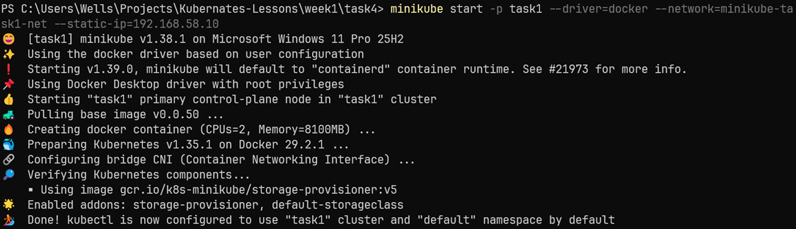

### Step 2. 確認叢集狀態正常

確認節點 `task1` 為 `Ready`，並且目前 `task1` profile 狀態為 `OK`。

```powershell
kubectl get nodes -o wide
kubectl get ns
minikube profile list
```

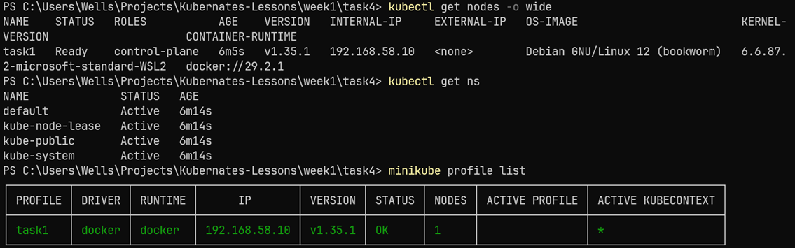

### Step 3. 建立 `sa-lab` 與 `probe-lab`

`sa-lab` 用來執行 `pod-reader`，`probe-lab` 作為被讀取的目標 namespace。

```powershell
kubectl apply -f .\namespace.yaml
kubectl apply -f ..\task3\namespace.yaml
kubectl get ns
```

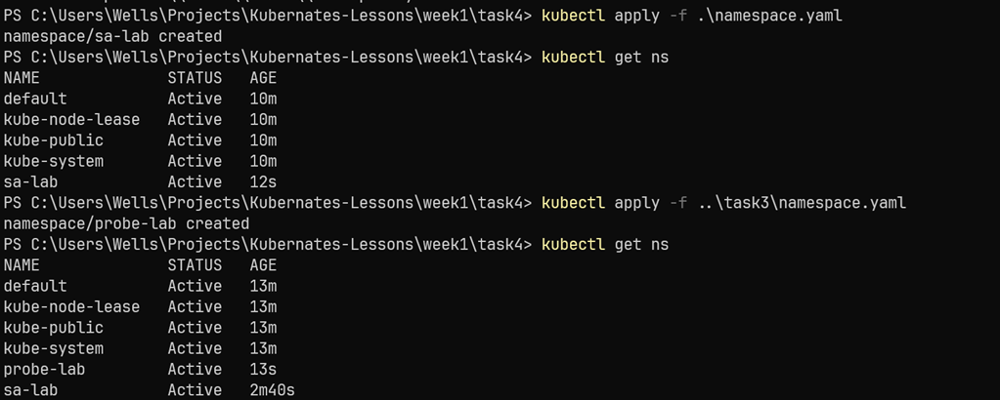

### Step 4. 建立 `probe-lab` 內的示範工作負載

建立 `nginx-probe-demo` Deployment、Service 與 `curl-client`，讓 `probe-lab` 內有多個可被查詢的 Pod。

```powershell
kubectl apply -f ..\task3\deployment.yaml
kubectl apply -f ..\task3\service.yaml
kubectl apply -f ..\task3\curl-client.yaml
```

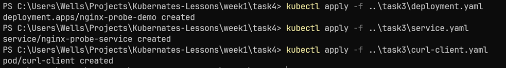

### Step 5. 確認 `probe-lab` 內的 Pod 已就緒

這一步是為了確保目標 namespace 真的有 Pod 可讀取。

```powershell
kubectl wait --for=condition=Available deployment/nginx-probe-demo -n probe-lab --timeout=180s
kubectl wait --for=condition=Ready pod/curl-client -n probe-lab --timeout=180s
kubectl get pods -n probe-lab -o wide
```

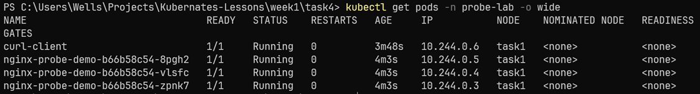

### Step 6. 建立 ServiceAccount 與 RBAC

在 `sa-lab` 建立 `pod-reader-sa`，並在 `probe-lab` 建立 `Role` / `RoleBinding`，讓 `pod-reader-sa` 具備 `list pods` 權限。

```powershell
kubectl apply -f .\rbac.yaml
kubectl get sa -n sa-lab
kubectl get role -n probe-lab
kubectl get rolebinding -n probe-lab
```

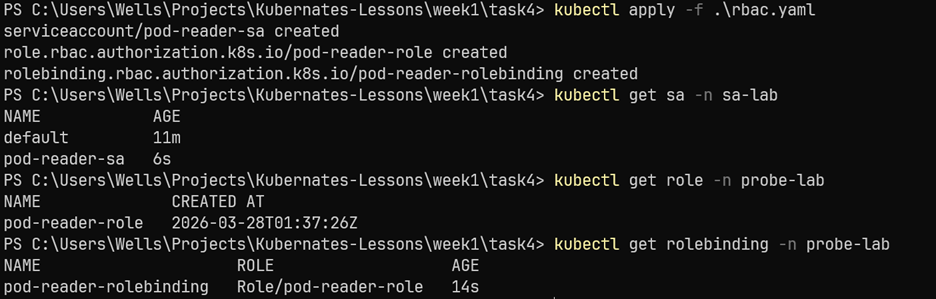

### Step 7. 驗證 RBAC 權限

使用 `kubectl auth can-i` 模擬 `pod-reader-sa`，確認它在 `probe-lab` 中可以列出 Pods。

```powershell
kubectl auth can-i list pods --as=system:serviceaccount:sa-lab:pod-reader-sa -n probe-lab
```

結果為 `yes`，表示 RBAC 設定正確。

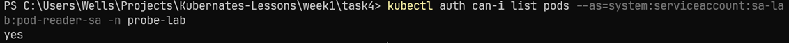

### Step 8. 建立本機測試 image

先用 Minikube 內建 image build 做功能驗證，避免一開始就卡在 Docker Hub push/pull。

```powershell
minikube image build -p task1 -t task4-pod-reader:local .
minikube image ls -p task1 | Select-String "task4-pod-reader"
```

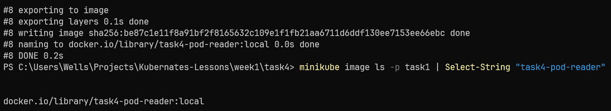

### Step 9. 建立 `pod-reader`

使用 `pod-local.yaml` 建立 `pod-reader`，讓 Pod 透過 `projected volume` 掛載 token 與 CA，並以 `pod-reader-sa` 身份執行。

```powershell
kubectl apply -f .\pod-local.yaml
kubectl get pod pod-reader -n sa-lab -o wide
```

`pod-reader` 顯示 `Completed` 是正常的，因為 `app.py` 是執行一次後結束，不是常駐服務。

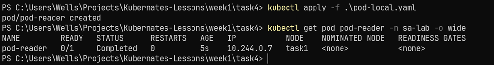

### Step 10. 查看 Pod logs

這一步是本題最終驗證。若設定正確，`pod-reader` 會呼叫 Kubernetes API，列出 `probe-lab` 內目前存在的 Pods。

```powershell
kubectl logs pod-reader -n sa-lab
```

實際結果：

```text
pod list in probe-lab namespace:
1. curl-client
2. nginx-probe-demo-b66b58c54-8pgh2
3. nginx-probe-demo-b66b58c54-vlsfc
4. nginx-probe-demo-b66b58c54-zpnk7
```

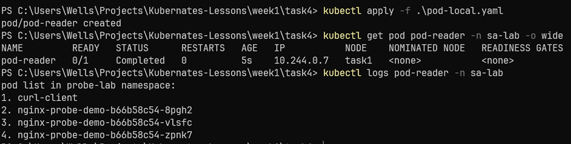

## 公開 Docker Hub image

本題最終也已將 image push 到 public Docker Hub registry：

`wellshuang814/k8s-pod-reader:week1-task4`

使用公開 image 驗證的指令如下：

```powershell
docker build -t wellshuang814/k8s-pod-reader:week1-task4 .\week1\task4
docker push wellshuang814/k8s-pod-reader:week1-task4
kubectl delete pod pod-reader -n sa-lab --ignore-not-found=true
kubectl apply -f .\week1\task4\pod.yaml
kubectl wait --for=jsonpath='{.status.phase}'=Succeeded pod/pod-reader -n sa-lab --timeout=180s
kubectl logs pod-reader -n sa-lab
```

公開 Docker Hub image 驗證結果：

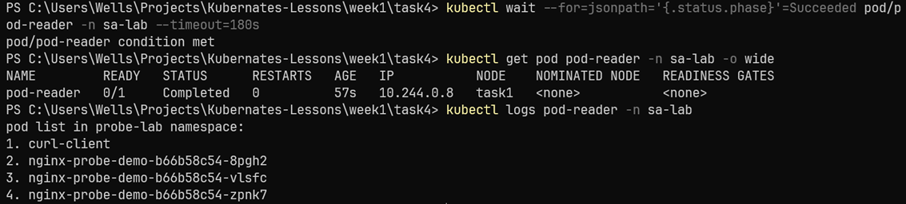

## 結論

本題已完成以下要求：

1. 使用 Python 撰寫呼叫 Kubernetes API 的程式
2. 將程式打包成容器 image
3. 使用 `ServiceAccount`、`Role`、`RoleBinding` 進行授權
4. 使用 `projected volume` 掛載短效 token 與 CA 憑證
5. 成功在 Pod logs 中列出 `probe-lab` 內的 Pod 清單
6. 成功將 image push 到 public Docker Hub registry
