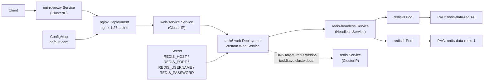
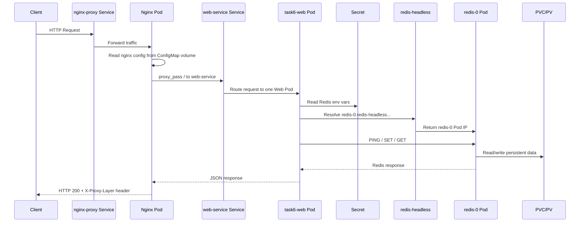
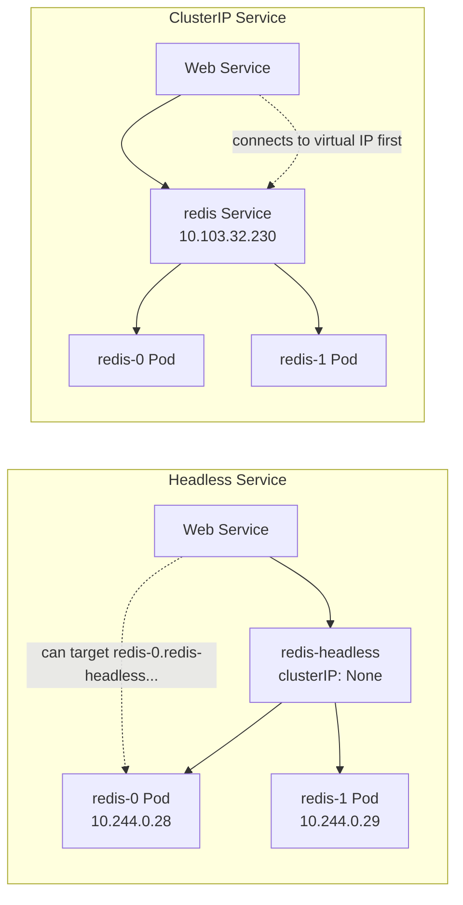

# Week2 Task6

本題目標是整合 `ConfigMap`、`StatefulSet`、`Headless Service`、`PVC` 與 `Secret`，完成一個可代理流量、可持久化資料、且能精準連到指定 Redis Pod 的 Kubernetes 練習。

這份 `README.md` 使用 UTF-8 編碼。

## 題目需求整理

1. 部署一個 Nginx Deployment，並將請求轉發到自己撰寫的 Web Service Pod。
2. 使用 Redis Image 部署一個 2 replicas 的 Redis StatefulSet，並透過 PV/PVC 確保資料持久化。
3. 驗證 Web Service 能透過 Headless Service 連到 Redis 的第一個 Pod，例如 `redis-0`，並完成資料存取。
4. 說明 Cluster 內 DNS 解析方式，以及 Headless Service 與 ClusterIP Service 的差異。
5. 使用 Secret 保存 Redis 連線資訊，並讓 Web Service Pod 透過環境變數讀取。

## 架構說明

流量路徑如下：

`client -> nginx-proxy Service -> nginx Deployment -> web-service Service -> task6-web Deployment -> redis-0.redis-headless Service -> redis StatefulSet`



設計重點：

- Nginx 使用官方 image，不自行 build
- Nginx 設定檔由 `ConfigMap` 掛載到容器內
- Web Service 是自製應用，負責讀取 Secret 並連線 Redis
- Redis 使用 `StatefulSet`，因此 Pod 名稱固定為 `redis-0`、`redis-1`
- Redis 使用 `Headless Service` 提供 Pod 級別 DNS
- Redis 使用 PVC 保存 `/data`，確保 Pod 重建後資料仍存在

## 流程圖說明



## 檔案說明

- `namespace.yaml`
  建立 `week2-task6` namespace
- `secret.yaml`
  定義 Redis 連線資訊，提供 Web Service 與 Redis Pod 使用
- `web-service/`
  自製 Web Service 程式與 Dockerfile
- `web-deployment.yaml`
  建立 Web Service Deployment
- `web-service.yaml`
  建立 Web Service ClusterIP Service
- `nginx-configmap.yaml`
  將 Nginx 反向代理設定存放於 ConfigMap
- `nginx-deployment.yaml`
  建立 Nginx Deployment，並以 Volume 掛載 ConfigMap
- `nginx-service.yaml`
  建立 Nginx ClusterIP Service
- `redis-headless-service.yaml`
  建立 Headless Service，提供 `redis-0`、`redis-1` Pod DNS
- `redis-service.yaml`
  建立 Redis 的一般 ClusterIP Service
- `redis-statefulset.yaml`
  建立 Redis StatefulSet 與對應 PVC
- `debug-pod.yaml`
  建立測試用 Pod，供 `exec`、`wget`、`nslookup` 使用

## Step 1. 確認環境

```powershell
minikube start -p task1 --driver=docker
kubectl config current-context
kubectl get nodes -o wide
kubectl get storageclass
```

預期結果：

- context 應為 `task1`
- node 應為 `Ready`
- Minikube 應存在預設 `StorageClass`

## Step 2. 建立 Web Service Image

本題不需要 build Nginx image，但需要 build 自製 Web Service image。

```powershell
minikube image build -p task1 -t task6-web:local .\week2\task6\web-service
minikube image ls -p task1 | Select-String "task6-web"
```

## Step 3. 套用 Kubernetes 資源

```powershell
kubectl apply -k .\week2\task6
kubectl get all -n week2-task6
kubectl get pvc -n week2-task6
```

### 實際驗證結果

```powershell
kubectl get all -n week2-task6
```

可看到：

- `nginx-proxy` Deployment 為 `2/2`
- `task6-web` Deployment 為 `2/2`
- `redis` StatefulSet 為 `2/2`
- Pod 包含 `redis-0`、`redis-1`

```powershell
kubectl get pvc -n week2-task6
```

可看到：

- `redis-data-redis-0` 為 `Bound`
- `redis-data-redis-1` 為 `Bound`

這表示 Redis StatefulSet 的兩個副本都已成功取得自己的持久化儲存空間。

## Step 4. 驗證 Nginx 使用 ConfigMap 掛載設定並成功代理流量

先建立 port-forward：

```powershell
kubectl port-forward service/nginx-proxy -n week2-task6 8080:80
```

另開視窗測試：

```powershell
curl.exe -i http://127.0.0.1:8080
```

### 實際驗證結果

回傳：

```http
HTTP/1.1 200 OK
Server: nginx/1.27.5
X-Proxy-Layer: task6-nginx
```

Response body：

```json
{
  "message": "task6 web service is running",
  "pod": "task6-web-66c9867bb4-m2q5g",
  "namespace": "week2-task6",
  "redis_target": "redis-0.redis-headless.week2-task6.svc.cluster.local",
  "cluster_service_name": "redis.week2-task6.svc.cluster.local"
}
```

可證明：

- 請求有先經過 Nginx，因為 response header 帶有 `X-Proxy-Layer: task6-nginx`
- Nginx 成功將流量轉發到後端 Web Service
- Web Service 也正常回應 JSON

## Step 5. 驗證 Web Service 透過 Secret 取得 Redis 連線資訊

```powershell
kubectl exec -n week2-task6 deploy/task6-web -- printenv | Select-String "REDIS_"
```

可確認 Pod 內具有以下環境變數：

- `REDIS_HOST`
- `REDIS_PORT`
- `REDIS_USERNAME`
- `REDIS_PASSWORD`

這些值來自 `secret.yaml`，表示 Web Service 已透過 Secret 注入連線資訊。

## Step 6. 驗證 Headless Service DNS 與 ClusterIP 差異

從 cluster 內測試：

```powershell
kubectl exec -n week2-task6 pod/dns-debug -- wget -qO- http://nginx-proxy/dns
```

### 實際驗證結果

```json
{
  "target_host": "redis-0.redis-headless.week2-task6.svc.cluster.local",
  "target_host_ips": [
    "10.244.0.28"
  ],
  "cluster_service_name": "redis.week2-task6.svc.cluster.local",
  "cluster_service_ips": [
    "10.103.32.230"
  ],
  "explanation": "target_host should resolve to redis-0 specifically, while cluster_service_name resolves to the Service virtual IP."
}
```

### 說明

`target_host` 使用的是：

`redis-0.redis-headless.week2-task6.svc.cluster.local`

它直接解析到 Pod IP `10.244.0.28`，表示 Web Service 連到的是 `redis-0` 這個特定 Pod。

而：

`redis.week2-task6.svc.cluster.local`

解析到的是 `10.103.32.230`，這是 Redis 的 ClusterIP Service 虛擬 IP，不代表任何單一 Pod。

### 如何確保能連到第一個 Pod

做法是使用 StatefulSet 固定命名規則，搭配 Headless Service：

- 第一個 Pod 名稱固定為 `redis-0`
- Headless Service 不建立單一 ClusterIP
- DNS 會直接回傳對應 Pod 的 IP

因此，只要連到：

`redis-0.redis-headless.week2-task6.svc.cluster.local`

就能穩定存取第一個 Redis Pod。

### Headless Service 與 ClusterIP Service 的差別

`Headless Service`

- `clusterIP: None`
- DNS 直接回 Pod IP
- 適合 StatefulSet、資料庫、需要固定 Pod 身分的服務
- 可以精準指定 `redis-0` 或 `redis-1`

`ClusterIP Service`

- 會建立一個虛擬 Service IP
- Client 連到的是 Service，不是直接連某個 Pod
- 適合一般無狀態服務做內部負載平衡
- 不保證會打到哪個後端 Pod



## Step 7. 驗證 Web Service 能透過 Headless Service 連到 Redis 並存取資料

```powershell
kubectl exec -n week2-task6 pod/dns-debug -- wget -qO- "http://nginx-proxy/redis/ping"
kubectl exec -n week2-task6 pod/dns-debug -- wget -qO- "http://nginx-proxy/redis/set?key=lesson&value=hello-task6"
kubectl exec -n week2-task6 pod/dns-debug -- wget -qO- "http://nginx-proxy/redis/get?key=lesson"
```

### 實際驗證結果

`PING`

```json
{
  "command": "PING",
  "result": "PONG",
  "connected_peer_ip": "10.244.0.28",
  "redis_target": "redis-0.redis-headless.week2-task6.svc.cluster.local"
}
```

`SET`

```json
{
  "command": "SET",
  "key": "lesson",
  "value": "hello-task6",
  "result": "OK",
  "connected_peer_ip": "10.244.0.28",
  "redis_target": "redis-0.redis-headless.week2-task6.svc.cluster.local"
}
```

`GET`

```json
{
  "command": "GET",
  "key": "lesson",
  "value": "hello-task6",
  "connected_peer_ip": "10.244.0.28",
  "redis_target": "redis-0.redis-headless.week2-task6.svc.cluster.local"
}
```

可證明：

- Web Service 能成功連線到 Redis
- 可正常執行 `PING`、`SET`、`GET`
- 實際連到的目標是 `redis-0`
- Web Service 是透過 Secret 提供的 Redis 連線資訊完成操作

## Step 8. 驗證 Redis StatefulSet 持久化

先寫入資料：

```powershell
kubectl exec -n week2-task6 pod/dns-debug -- wget -qO- "http://nginx-proxy/redis/set?key=persist&value=survive-restart"
```

刪除 `redis-0`：

```powershell
kubectl delete pod redis-0 -n week2-task6
kubectl wait --for=condition=Ready pod/redis-0 -n week2-task6 --timeout=180s
```

再讀取資料：

```powershell
kubectl exec -n week2-task6 pod/dns-debug -- wget -qO- "http://nginx-proxy/redis/get?key=persist"
```

### 實際驗證結果

刪除前寫入：

```json
{
  "command": "SET",
  "key": "persist",
  "value": "survive-restart",
  "result": "OK",
  "connected_peer_ip": "10.244.0.28",
  "redis_target": "redis-0.redis-headless.week2-task6.svc.cluster.local"
}
```

重建後讀取：

```json
{
  "command": "GET",
  "key": "persist",
  "value": "survive-restart",
  "connected_peer_ip": "10.244.0.31",
  "redis_target": "redis-0.redis-headless.week2-task6.svc.cluster.local"
}
```

### 說明

可以看到：

- `connected_peer_ip` 從 `10.244.0.28` 變成 `10.244.0.31`
- 代表 `redis-0` 已經是新的 Pod 實例
- 但資料 `survive-restart` 仍然存在

這證明 Redis 的資料不是存在 Pod 本身，而是存在 PVC 對應的持久化儲存上，因此 Pod 被刪除後重新建立，資料仍然能保留。

## Step 9. 觀察 Logs

```powershell
kubectl logs -n week2-task6 -l app=nginx-proxy --tail=20 --prefix=true
kubectl logs -n week2-task6 -l app=task6-web --tail=20 --prefix=true
```

可觀察：

- Nginx 是否收到請求
- Web Service 是否有處理 `/dns`、`/redis/ping`、`/redis/set`、`/redis/get`

## 結論

本題已完成以下要求：

1. 使用 ConfigMap 掛載 Nginx 設定檔，不需自行 build Nginx image，即可完成代理設定。
2. 成功部署 Nginx Deployment，並將請求轉發至自製 Web Service。
3. 成功部署 Redis StatefulSet，副本數為 2，並透過 PVC 實現資料持久化。
4. 成功驗證 Web Service 能透過 Headless Service 精準連到 `redis-0` 並完成 Redis 資料讀寫。
5. 成功說明 Headless Service 與 ClusterIP Service 的 DNS 解析差異。
6. 成功使用 Secret 將 Redis 連線資訊注入 Web Service Pod。

## 清理資源

```powershell
kubectl delete -k .\week2\task6
```
