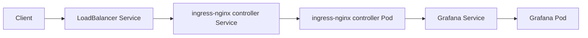
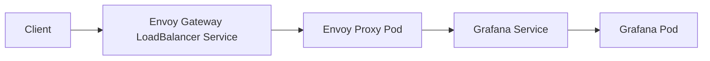

# Week2 Task8

本題目標是使用 Helm 安裝開源服務，透過 `ingress-nginx` 以 hostname 規則導流，並讓 Ingress Controller 經由 `LoadBalancer Service` 對外提供入口。完成必做題後，再使用 Gateway API + Envoy Gateway 取代 Ingress，驗證同樣的流量轉送能力。

## 需求整理

1. 使用 Helm Chart 安裝開源服務。
2. 使用 `ingress-nginx` 作為 Ingress Controller，依照 hostname 規則把流量轉送到開源服務。
3. 使用 `LoadBalancer Service` 讓外部流量先進入 Ingress Controller，再進入應用服務。
4. 進階題改用 Gateway API，使用 Envoy Gateway 取代 Ingress。

## 本題選擇

- Kubernetes 環境：Minikube profile `task1`
- 應用服務：Grafana
- 應用 namespace：`task8`
- Grafana hostname：`grafana.task8.local`
- Grafana release name：`grafana`
- ingress-nginx release name：`ingress-nginx`
- Envoy Gateway release name：`eg`

## 關於 Ghost 範例的調整

題目舉例使用 Bitnami `ghost` chart，但 2026-03-23 實際測試時，該 chart 參照的 `bitnami/ghost` 與 `bitnami/mysql` image tag 發生 `manifest unknown`，導致 Pod 卡在 `ImagePullBackOff`，因此本次改用同樣符合題意的 Helm 開源服務 `grafana/grafana` 完成題目要求。

## 參考文件

- [Grafana Helm chart](https://github.com/grafana/helm-charts/tree/main/charts/grafana)
- [ingress-nginx](https://github.com/kubernetes/ingress-nginx)
- [Envoy Gateway gateway-helm docs](https://gateway.envoyproxy.io/latest/install/gateway-helm-api/)

## 檔案結構

```text
week2/task8/
├─ grafana-values.yaml
├─ ingress-nginx-values.yaml
├─ grafana-ingress.yaml
├─ gateway-httproute.yaml
└─ README.md
```

## 架構圖

### 必做題 1-3



### 進階題 4



## 環境確認

2026-03-23 實際確認結果：

- `kubectl` 可用
- Helm 使用 repo 內提供的二進位檔：`.\.tools\helm\helm.exe`
- current context 指向 Minikube `task1`
- node `task1` 狀態為 `Ready`

常用 Helm 路徑：

```powershell
$helm = (Resolve-Path ..\..\.tools\helm\helm.exe).Path
```

## 設定檔

### `grafana-values.yaml`

```yaml
fullnameOverride: grafana

adminUser: admin

service:
  type: ClusterIP
  port: 80
  targetPort: 3000

ingress:
  enabled: false

testFramework:
  enabled: false

persistence:
  enabled: false

resources:
  requests:
    cpu: 100m
    memory: 128Mi
  limits:
    cpu: 250m
    memory: 256Mi
```

說明：

- Grafana 服務維持 `ClusterIP`
- 外部入口交給 Ingress 或 Gateway API 負責
- admin password 不直接寫入 repo，由 chart 自動產生 Secret
- 關閉 chart 內建 `ingress`
- 關閉 persistence，先降低本地 Minikube 練習複雜度

### `ingress-nginx-values.yaml`

```yaml
controller:
  ingressClassResource:
    name: nginx
    default: false
  ingressClass: nginx
  watchIngressWithoutClass: false
  replicaCount: 1
  service:
    type: LoadBalancer
    externalTrafficPolicy: Cluster

defaultBackend:
  enabled: false
```

說明：

- 建立 `IngressClass/nginx`
- 只處理 `ingressClassName: nginx` 的 Ingress
- 將 ingress-nginx controller service 設為 `LoadBalancer`

### `grafana-ingress.yaml`

```yaml
apiVersion: networking.k8s.io/v1
kind: Ingress
metadata:
  name: grafana-host-ingress
  namespace: task8
spec:
  ingressClassName: nginx
  rules:
    - host: grafana.task8.local
      http:
        paths:
          - path: /
            pathType: Prefix
            backend:
              service:
                name: grafana
                port:
                  number: 80
```

### `gateway-httproute.yaml`

```yaml
apiVersion: gateway.networking.k8s.io/v1
kind: GatewayClass
metadata:
  name: eg
spec:
  controllerName: gateway.envoyproxy.io/gatewayclass-controller
---
apiVersion: gateway.networking.k8s.io/v1
kind: Gateway
metadata:
  name: grafana-gateway
  namespace: task8
spec:
  gatewayClassName: eg
  listeners:
    - name: http
      protocol: HTTP
      port: 80
      hostname: grafana.task8.local
      allowedRoutes:
        namespaces:
          from: Same
---
apiVersion: gateway.networking.k8s.io/v1
kind: HTTPRoute
metadata:
  name: grafana-route
  namespace: task8
spec:
  parentRefs:
    - name: grafana-gateway
  hostnames:
    - grafana.task8.local
  rules:
    - matches:
        - path:
            type: PathPrefix
            value: /
      backendRefs:
        - name: grafana
          port: 80
```

## 實作步驟

### Step 1. 建立 namespace

```powershell
kubectl create namespace task8
```

### Step 2. 設定 Helm repositories

```powershell
& $helm repo add grafana https://grafana.github.io/helm-charts
& $helm repo add ingress-nginx https://kubernetes.github.io/ingress-nginx
& $helm repo update
```

### Step 3. 安裝 Grafana

先查看 chart 版本：

```powershell
& $helm search repo grafana/grafana --versions | Select-Object -First 5
```

再安裝 Grafana：

```powershell
& $helm upgrade --install grafana grafana/grafana --version 10.5.15 -n task8 -f .\grafana-values.yaml --wait --timeout 10m
kubectl get all -n task8
```

實際結果：

- `deployment/grafana` ready
- `service/grafana` 為 `ClusterIP`
- `pod/grafana-...` 狀態為 `Running`
- admin password 由 chart 自動產生，可透過 Secret 查詢：

```powershell
kubectl get secret --namespace task8 grafana -o jsonpath="{.data.admin-password}" | %{ [System.Text.Encoding]::UTF8.GetString([System.Convert]::FromBase64String($_)) }
```

### Step 4. 先驗證 Grafana 服務本身

```powershell
kubectl port-forward -n task8 service/grafana 3000:80
```

另開新視窗驗證：

```powershell
curl.exe -I http://127.0.0.1:3000
```

實際結果：

```http
HTTP/1.1 302 Found
Location: /login
```

說明：

- `302 Found` 代表 Grafana 已收到請求
- 由 `/` 重新導向到 `/login`
- 這證明應用本身可以正常回應 HTTP

### Step 5. 安裝 ingress-nginx

先查看 chart 版本：

```powershell
& $helm search repo ingress-nginx/ingress-nginx --versions | Select-Object -First 5
```

再安裝 ingress-nginx controller：

```powershell
& $helm upgrade --install ingress-nginx ingress-nginx/ingress-nginx --version 4.15.1 -n ingress-nginx --create-namespace -f .\ingress-nginx-values.yaml --wait --timeout 10m
kubectl get all -n ingress-nginx
```

安裝後重點：

- `service/ingress-nginx-controller` 為 `LoadBalancer`
- `service/ingress-nginx-controller-admission` 為 `ClusterIP`
- `deployment/ingress-nginx-controller` ready

### Step 6. 建立 Host-based Ingress

```powershell
kubectl apply -f .\grafana-ingress.yaml
kubectl get ingress -n task8
```

實際結果：

- `CLASS = nginx`
- `HOSTS = grafana.task8.local`

### Step 7. 驗證 ingress-nginx 的 hostname 導流

先將本機 port-forward 到 ingress controller：

```powershell
kubectl port-forward -n ingress-nginx service/ingress-nginx-controller 18080:80
```

另開新視窗驗證：

```powershell
curl.exe -I -H "Host: grafana.task8.local" http://127.0.0.1:18080
```

實際結果：

```http
HTTP/1.1 302 Found
Location: /login
```

說明：

- 請求先進入 ingress-nginx controller
- ingress-nginx 根據 `Host: grafana.task8.local` 命中 Ingress 規則
- 再將流量轉送到 Grafana service

### Step 8. 驗證 LoadBalancer 入口

在 Minikube + Docker driver + Windows 環境中，需要開啟 tunnel：

```powershell
minikube tunnel -p task1
kubectl get svc -n ingress-nginx
```

實際結果：

```text
service/ingress-nginx-controller   LoadBalancer   ...   EXTERNAL-IP 127.0.0.1
```

因本機 `127.0.0.1:80` 被 IIS 佔用，直接測試：

```powershell
curl.exe -I -H "Host: grafana.task8.local" http://127.0.0.1
```

會打到本機 IIS，而不是 Minikube LoadBalancer，因此改用：

```powershell
minikube service ingress-nginx-controller -n ingress-nginx --url -p task1
```

本次實際得到：

```text
http://127.0.0.1:64635
http://127.0.0.1:64636
```

其中 HTTP 入口為：

```powershell
curl.exe -I -H "Host: grafana.task8.local" http://127.0.0.1:64635
```

實際結果：

```http
HTTP/1.1 302 Found
Location: /login
```

補充：

- `64635`、`64636` 為 Minikube 在本次執行時動態分配的本機代理 port
- 每次執行 `minikube service --url` 時，port 可能不同

### Step 9. 安裝 Envoy Gateway

先確認 chart：

```powershell
& $helm show chart oci://docker.io/envoyproxy/gateway-helm --version v1.4.6
```

再安裝 Envoy Gateway controller：

```powershell
& $helm upgrade --install eg oci://docker.io/envoyproxy/gateway-helm --version v1.4.6 -n envoy-gateway-system --create-namespace --wait --timeout 10m
kubectl get pods -n envoy-gateway-system -o wide
```

安裝後發現：

- Envoy Gateway controller 會被安裝
- 但不會自動建立 `GatewayClass`

因此需要自己建立 `GatewayClass`、`Gateway`、`HTTPRoute`

### Step 10. 建立 Gateway API 資源

```powershell
kubectl apply -f .\gateway-httproute.yaml
kubectl get gatewayclass
kubectl get gateway -n task8
kubectl get httproute -n task8
```

建立後確認：

- `GatewayClass/eg` 被 Envoy Gateway 接受
- `HTTPRoute/grafana-route` 成功附掛到 `Gateway/grafana-gateway`

可進一步查看狀態：

```powershell
kubectl get gateway grafana-gateway -n task8 -o yaml
kubectl get httproute grafana-route -n task8 -o yaml
kubectl get all -n envoy-gateway-system
```

實際觀察：

- `HTTPRoute` 的 `Accepted=True`
- `ResolvedRefs=True`
- Envoy Gateway 為 `grafana-gateway` 動態建立：
  - Envoy data plane Pod
  - `LoadBalancer Service`

### Step 11. 驗證 Gateway API 入口

先等待 Envoy Gateway 建立出的 LoadBalancer service 取得外部位址：

```powershell
kubectl get svc -n envoy-gateway-system
```

實際結果：

```text
service/envoy-task8-grafana-gateway-8a8c9f0f   LoadBalancer   ...   EXTERNAL-IP 127.0.0.1
```

補充：

- `envoy-task8-grafana-gateway-8a8c9f0f` 這類 service 名稱中的 hash 會隨重建而改變，實際操作時請以 `kubectl get svc -n envoy-gateway-system` 的輸出為準。

同樣因本機 80 port 衝突，改用：

```powershell
minikube service envoy-task8-grafana-gateway-8a8c9f0f -n envoy-gateway-system --url -p task1
```

本次實際得到：

```text
http://127.0.0.1:52326
```

驗證：

```powershell
curl.exe -I -H "Host: grafana.task8.local" http://127.0.0.1:52326
```

實際結果：

```http
HTTP/1.1 302 Found
location: /login
```

說明：

- 這表示 Gateway API + Envoy Gateway 已成功接手 `grafana.task8.local`
- 並將流量導向 Grafana service

## 驗收結果

本題已完成以下項目：

1. 已使用 Helm Chart 安裝開源服務 Grafana。
2. 已使用 `ingress-nginx` 建立 hostname-based Ingress。
3. 已驗證外部流量可經由 `LoadBalancer Service` 進入 ingress-nginx，再轉送到 Grafana。
4. 已使用 Gateway API 建立 `GatewayClass`、`Gateway`、`HTTPRoute`。
5. 已驗證 Envoy Gateway 可透過 Gateway API 將 `grafana.task8.local` 導流到 Grafana。

## 結論

本次實作先以 Helm 安裝 Grafana，並成功透過 `ingress-nginx` 以 hostname 規則將外部流量導向 Grafana。接著再以 Gateway API + Envoy Gateway 重建相同的入口能力，驗證 `GatewayClass`、`Gateway` 與 `HTTPRoute` 也能完成同樣的導流需求，符合題目必做題與進階題要求。

## Cleanup

若要清除 task8 相關資源，可依序執行：

```powershell
kubectl delete ingress grafana-host-ingress -n task8
kubectl delete httproute grafana-route -n task8
kubectl delete gateway grafana-gateway -n task8
kubectl delete gatewayclass eg
& $helm uninstall grafana -n task8
& $helm uninstall eg -n envoy-gateway-system
& $helm uninstall ingress-nginx -n ingress-nginx
kubectl delete namespace task8
```

若 `GatewayClass` 因 controller 已卸載而卡在 `Terminating`，可手動移除 finalizer：

```powershell
kubectl patch gatewayclass eg --type=merge -p '{\"metadata\":{\"finalizers\":[]}}'
```
