# Week2 Task9

這題的目標是建立一條最小可驗證的 logging pipeline：

1. 用 Helm 安裝 Loki 與 Grafana
2. 部署一個會把 access log 寫到 `hostPath` 的 Nginx
3. 以 DaemonSet 部署 log collector
4. 把 `hostPath` 裡的 log 送進 Loki
5. 在 Grafana Explore 查到這些 log

## 本題架構

- Namespace: `task9`
- Loki release name: `loki`
- Grafana release name: `grafana`
- Log collector: `Fluent Bit DaemonSet`
- Nginx hostPath: `/var/log/task9-nginx`

## 元件關係

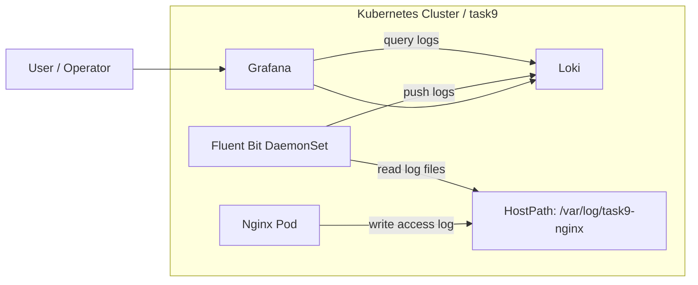

## 為什麼不用 Promtail

Grafana 官方文件在 2025-02-13 起將 Promtail 標示為 LTS，並說明其 EOL 會在 2026-03-02 開始。現在日期是 2026-03-30，所以這份解法改用目前仍維護中的 `Fluent Bit`。

## 檔案

```text
week2/task9/
├─ loki-values.yaml
├─ grafana-values.yaml
├─ nginx-configmap.yaml
├─ nginx.yaml
├─ fluent-bit-configmap.yaml
├─ fluent-bit-daemonset.yaml
├─ 01_create_namespace.png
├─ 02_check_Loki_Grafana_version.png
├─ 03_Loki_Setting.png
├─ 04_Grafana_Setting.png
├─ 05_Loki_installed_and_gateway_is_running.png
├─ 06_Grafana_is_running.png
├─ 07_Nginx_is_running.png
├─ 08_FluentBit_start_logging.png
├─ 09_AccessLog_created_in_Nginx.png
├─ 10_Logs_in_Loki.png
├─ 11_Logs_in_Grafana.png
└─ README.md
```

## 設定重點

- Loki 採 `SingleBinary`，適合單機 Minikube 練習
- Loki 需要可寫儲存，所以 `singleBinary.persistence.enabled: true`
- Grafana 透過 `datasources.yaml` 預先 provision Loki datasource
- Nginx 將 log 寫到 node 上的 `/var/log/task9-nginx`
- Fluent Bit 以 DaemonSet 方式讀取同一個 `hostPath`，並送往 `loki-gateway`

## 驗證流程

1. 建立 `task9` namespace
2. 確認 Loki 與 Grafana chart 版本
3. 安裝 Loki 並確認 `loki-0`、`loki-gateway` 正常
4. 安裝 Grafana 並確認 `datasources.yaml` 內已有 Loki
5. 部署 Nginx，將 access log 寫到 `hostPath`
6. 部署 Fluent Bit DaemonSet，讀取 `hostPath`
7. 對 Nginx 送出請求，產生 access log
8. 直接查 Loki API，確認 `{job="task9-nginx"}` 有結果
9. 進入 Grafana Explore，確認可查到相同 log

## 截圖紀錄

### 1. 建立 Namespace

先建立 `task9` namespace，讓 Loki、Grafana、Nginx 與 Fluent Bit 都放在同一個 namespace，後續驗證與清理都會比較容易。

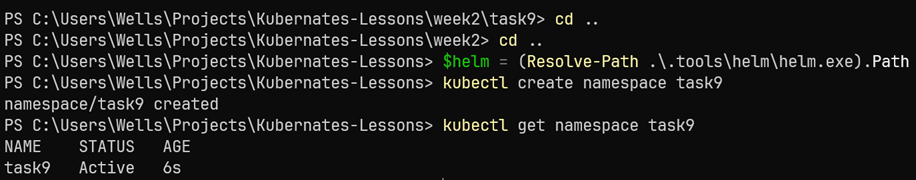

### 2. 確認 Loki / Grafana Chart 版本

在安裝前先確認官方 Helm repo 中可用的 chart 版本，避免教學過程中因版本差異造成指令或欄位不一致。這次使用的版本是：

- Loki chart `6.55.0`
- Grafana chart `10.5.15`

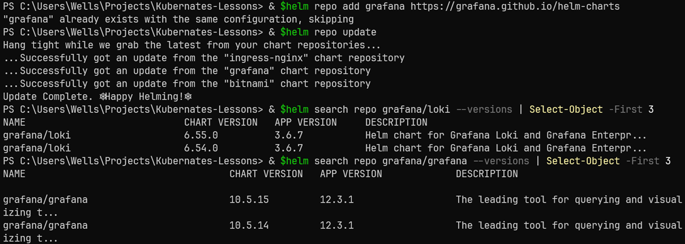

### 3. Loki 設定檔重點

安裝前先閱讀 `loki-values.yaml`。本題使用 `SingleBinary` 模式，因為這是單機 Minikube 練習環境，架構越單純越容易驗證。另外 `singleBinary.persistence.enabled: true` 也很重要，因為 Loki 需要可寫的儲存空間，否則 Pod 可能無法正常啟動。

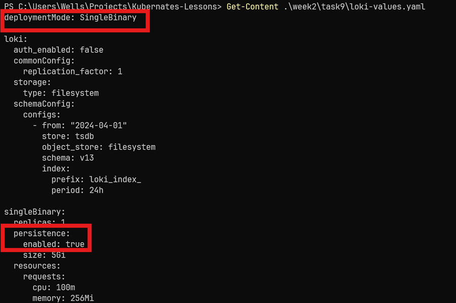

### 4. Grafana 設定檔重點

接著查看 `grafana-values.yaml`。這裡最關鍵的是 `datasources.yaml`，它會在 Grafana 啟動時自動建立 Loki datasource，讓我們不需要手動到 UI 裡新增資料來源。`url: http://loki-gateway.task9.svc.cluster.local` 則代表 Grafana 會透過 Kubernetes Service DNS 去連 Loki gateway。

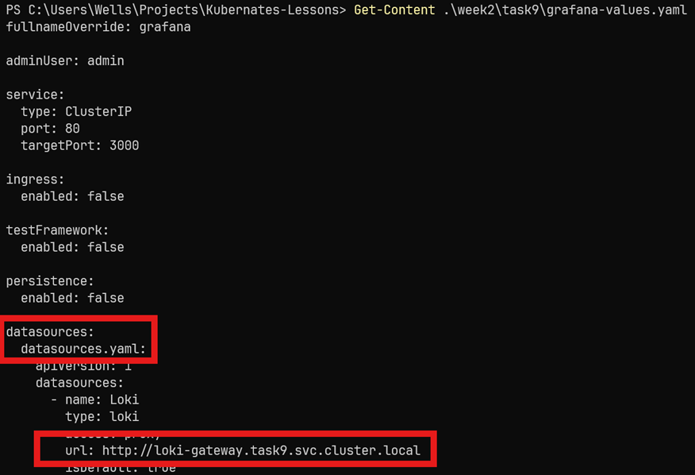

### 5. Loki 安裝完成，Gateway 已建立

安裝 Loki 後，最重要的觀察點有兩個：

- `loki-0` 已經 `Running`
- `service/loki-gateway` 已建立

`loki-0` 是這次 `SingleBinary` 模式下的 Loki 本體，而 `loki-gateway` 是叢集內其他元件要連 Loki 時使用的入口。

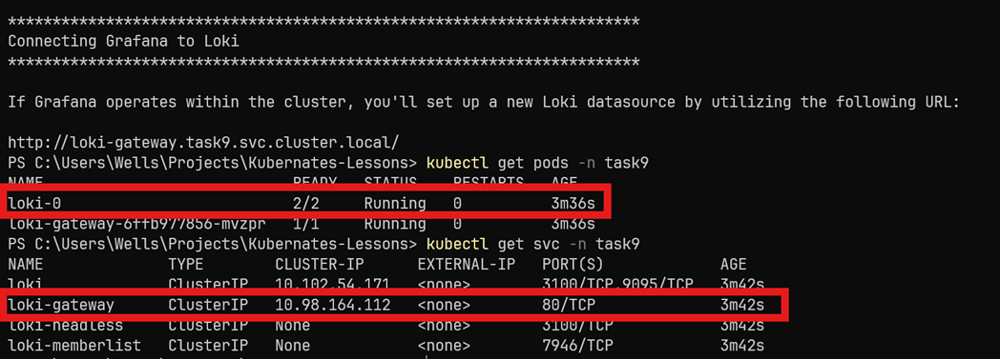

### 6. Grafana 啟動完成，並已 provision Loki datasource

安裝 Grafana 後，需要確認兩件事：

- `grafana` Pod 與 Service 已正常建立
- `configmap/grafana` 內的 `datasources.yaml` 已包含 `Loki`

這代表 Grafana 一啟動就已經知道要去哪裡查 Loki，不需要額外手動設定 datasource。

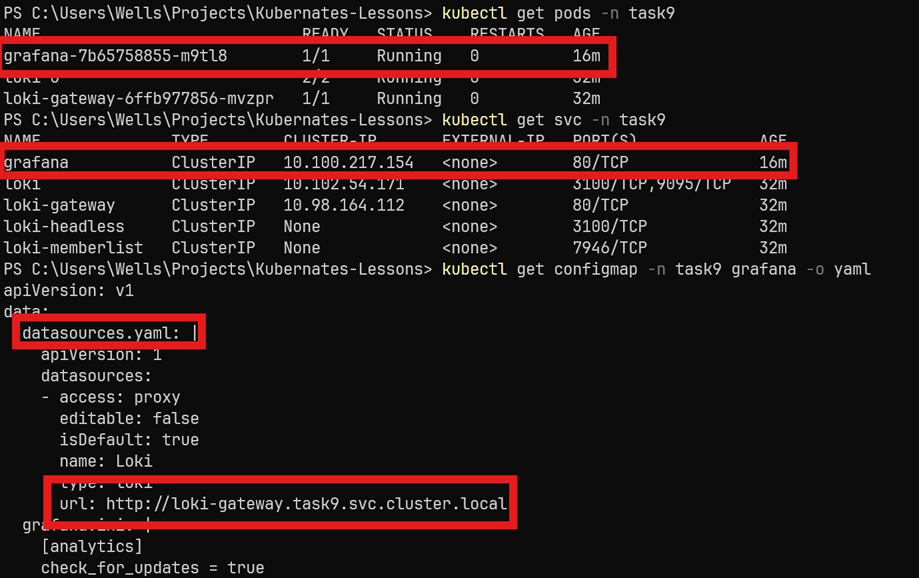

### 7. Nginx Pod / Service / Deployment 已建立

接下來部署 Nginx。這個 Nginx 不是單純提供 HTTP 回應而已，它還會把 access log 寫到掛載進 Pod 的 `hostPath`。也就是說，Nginx 寫在 `/var/log/nginx` 的內容，實際上會落到 node 上的 `/var/log/task9-nginx`。

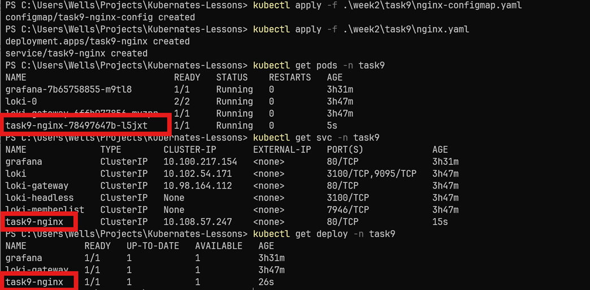

### 8. Fluent Bit DaemonSet 已開始收集 Log

部署 Fluent Bit 後，要確認：

- DaemonSet 已建立
- 對應的 Fluent Bit Pod 已 `Running`
- `kubectl logs` 中能看到它的 `tail` input 已初始化

Fluent Bit 在這題扮演的是 log collector，負責讀取 `hostPath` 內的 Nginx log，再把資料推送到 Loki。

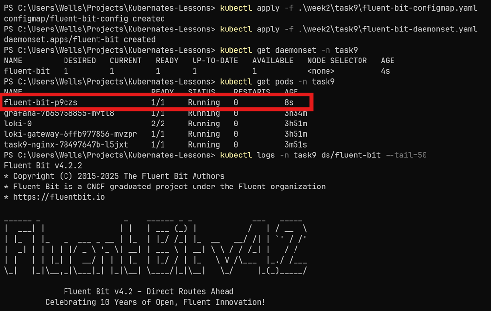

### 9. Nginx 已寫出 Access Log

當使用 `curl` 對 Nginx 發出多次請求後，可以直接進 Pod 讀取 `/var/log/nginx/access.log`。如果畫面中出現多筆 `GET / HTTP/1.1` 紀錄，就表示 Nginx 已成功把 access log 寫到我們指定的路徑。

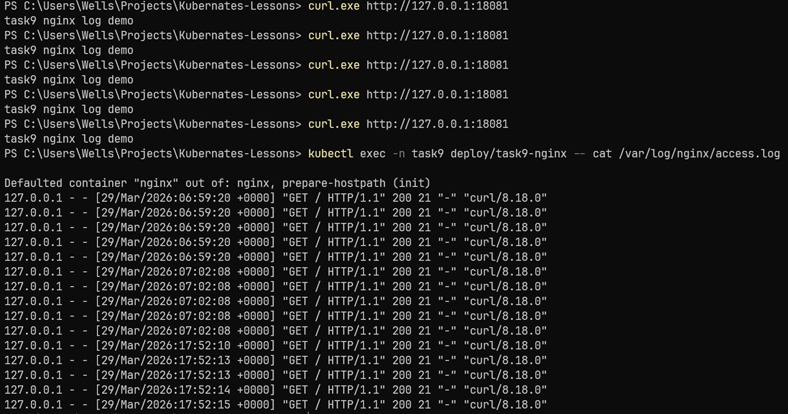

### 10. Loki API 已查到 Log

接著直接查 Loki API，而不是先看 Grafana UI。只要 `query_range` 回傳：

- `"status":"success"`
- `"resultType":"streams"`
- `"job":"task9-nginx"`

就代表整條資料流 `Nginx -> hostPath -> Fluent Bit -> Loki` 已經打通。

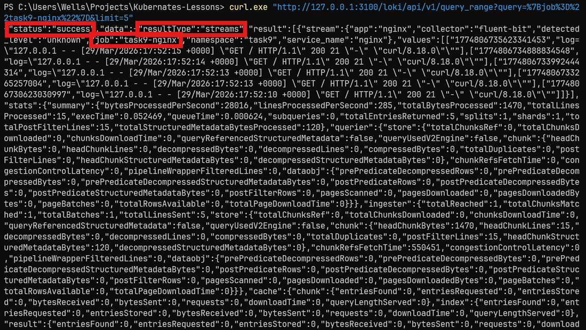

### 11. Grafana Explore 已查到 Log

最後進到 Grafana Explore，以 `Loki` 為 datasource，並用 `{job="task9-nginx"}` 查詢。若畫面下方能顯示多筆 `GET / HTTP/1.1` log line，就表示 Grafana 也已成功從 Loki 查回資料。這是最完整、也最直觀的最終成果畫面。

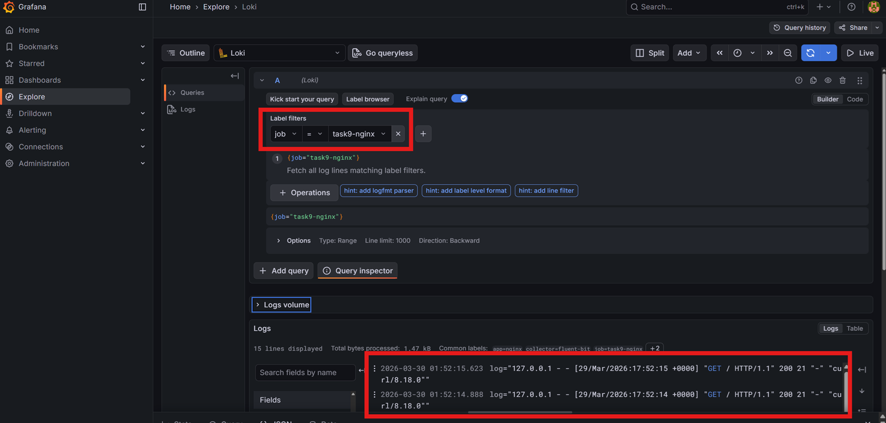

## Cleanup

```powershell
kubectl delete namespace task9
& $helm uninstall loki -n task9
& $helm uninstall grafana -n task9
```
