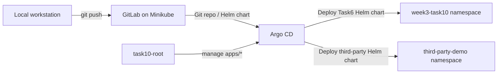

# Week3 Task10

## 題目目標

1. 在 Kubernetes 中部署 GitLab，並驗證本地 repo 可以成功 push 上去。
2. 部署 Argo CD，把 `week2/task6` 轉成 Helm Chart 後放進 GitLab repo，再由 Argo CD 部署到 cluster。
3. 使用 Argo CD 部署第三方 Helm Chart。
4. 把前面手動建立的兩個 Applications 改成 YAML(Custom Resource) 管理。
5. 進一步用 App of Apps 方式管理這兩個 Applications。

## 本次實作路線

- Kubernetes 環境：Minikube profile `task1`
- GitLab：`Deployment + PVC + Service`
- GitLab 存取方式：
  - 本機瀏覽器與 `git push`：`http://127.0.0.1:18080`
  - Argo CD 從 cluster 內抓 GitLab repo：`http://host.minikube.internal:18080`
- Argo CD：官方安裝 manifest
- Task6：轉成 GitLab repo 內的 Helm Chart，由 Argo CD 從 Git repo path 部署
- 第三方 Helm：Bitnami `nginx`
- App 管理方式：先手動建立，再改成 YAML，最後升級成 App of Apps

## 架構概念



## 實作重點

- GitLab 雖然部署在 Minikube 裡，但在 Windows + Docker driver 環境下，`minikube ip` 通常不是瀏覽器可直接連上的位址，所以最後改用 `kubectl port-forward`。
- Argo CD 安裝時，CRD 太大會遇到 `metadata.annotations: Too long`，因此要改成 `server-side apply`。
- 第三方 Helm Chart 一開始用了不存在的 image tag，導致 `Init:ImagePullBackOff`，後來換成可用的 chart 版本後才成功。
- 第三方 Helm Chart 預設 `service.type=LoadBalancer`，在本機 Minikube 沒有 external load balancer 基礎設施時，`EXTERNAL-IP` 會停在 `<pending>`，Argo CD 可能因此維持 `Progressing`。後來改成 `ClusterIP` 才變成 `Healthy`。

## 流程紀錄

### Step 0. 重設並確認叢集基線

先把 Minikube `task1` 重設，確認環境乾淨，只保留基礎 namespaces 與預設 storage class。

代表意義：

- 後續所有部署都從乾淨環境開始
- 避免前面練習殘留資源影響結果

相關截圖：

- [01_clean_cluster_baseline.png](./01_clean_cluster_baseline.png)
  代表 Minikube 重設後的基線狀態已確認完成。

### Step 1. 確認 Minikube IP、Helm 路徑與 GitLab 存取策略

先確認：

- `minikube ip`
- `helm.exe` 路徑
- GitLab 預計使用的 URL

本來嘗試用 Minikube IP，但在 Windows + Docker driver 情境下，最後改成用 `kubectl port-forward` 對外提供 GitLab。

代表意義：

- 確認工具都可用
- 確認 GitLab 後續從本機如何存取

相關截圖：

- [02_minikube_ip_helm_gitlab_url.png](./02_minikube_ip_helm_gitlab_url.png)
  代表已確認 `minikube ip`、Helm 路徑，以及 GitLab 連線策略。

### Step 2. 部署 GitLab 到 Kubernetes

GitLab 使用：

- `Namespace`
- `PVC`
- `Deployment`
- `Service`

進行部署。

部署重點：

- GitLab Pod 要能 `Running`
- PVC 要成功 `Bound`
- Service 要建立成功

代表意義：

- cluster 內已經有可用的 Git 服務
- 後續可以把 GitOps repo push 上去

相關截圖：

- [03_gitlab_resources_ready.png](./03_gitlab_resources_ready.png)
  代表 GitLab 相關 Kubernetes 資源已建立完成，包含 Service 與 PVC。
- [04_gitlab_sign_in.png](./04_gitlab_sign_in.png)
  代表 GitLab Web UI 已可登入，說明 GitLab 服務已經可用。

### Step 3. 建立 GitLab project 並 push GitOps repo

在 GitLab 內建立 `task10-gitops` project，然後把 `week3/task10/gitops-repo` push 上去。

這一步實際碰到的情況：

- Windows Git 安全性檢查需要設定 `safe.directory`
- 因為 GitLab project 先有預設 `README.md` commit，所以本地 repo 需要先 `pull --allow-unrelated-histories`

代表意義：

- GitLab 已成為本題的 GitOps source of truth
- 後續 Argo CD 會直接從這個 repo 抓 chart 與 Application YAML

相關截圖：

- [05_gitops_repo_push_success.png](./05_gitops_repo_push_success.png)
  代表本地 GitOps repo 已成功 push 到 GitLab。
- [06_gitlab_repo_contents.png](./06_gitlab_repo_contents.png)
  代表 GitLab project 內已經可以看到 `charts/`、`apps/`、`bootstrap/` 等內容。

### Step 4. 驗證 Task6 Helm Chart 並 build web image

先驗證：

- `helm lint`
- `helm template`

接著把 `task6-web:local` build 進 Minikube，讓 Argo CD 後續部署時可以直接使用。

代表意義：

- `week2/task6` 已成功轉成 Helm Chart
- Helm Chart 語法正確
- Task6 自製 image 已進入 Minikube 可用的 image cache

相關截圖：

- [07_task6_chart_lint_and_image_build.png](./07_task6_chart_lint_and_image_build.png)
  代表 Task6 Helm Chart 驗證成功，且 `task6-web:local` image 已 build 完成。

### Step 5. 安裝並登入 Argo CD

Argo CD 使用官方安裝 manifest。

安裝過程中實際碰到：

- `The CustomResourceDefinition "applicationsets.argoproj.io" is invalid: metadata.annotations: Too long`

解法：

- 改用 `kubectl apply --server-side`
- 若有欄位衝突，再加上 `--force-conflicts`

接著：

- 確認 `argocd` namespace 下各元件狀態
- 用 `port-forward` 開啟 Argo CD UI
- 用初始密碼登入

代表意義：

- Argo CD 控制面已可用
- 後續可以建立 Applications

相關截圖：

- [08_argocd_components_ready.png](./08_argocd_components_ready.png)
  代表 Argo CD 各元件已經安裝完成並處於可用狀態。
- [09_argocd_login.png](./09_argocd_login.png)
  代表已成功登入 Argo CD UI。

### Step 6. 手動建立 `task6-platform` Application

在 Argo CD 手動建立第一個 Application：

- Repo URL：GitLab repo
- Path：`charts/task6-platform`
- Namespace：`week3-task10`

同步設定包含：

- `Enable Auto-Sync`
- `Prune Resources`
- `Self Heal`
- `Auto-Create Namespace`

第一次同步時曾出現 `namespace not found`，後來手動建立 `week3-task10` namespace 後重新同步成功。

代表意義：

- Argo CD 已成功從 GitLab repo 讀取 Helm Chart
- Task6 平台已經由 GitOps 流程部署到 cluster

相關截圖：

- [10_task6_application_sync_policy.png](./10_task6_application_sync_policy.png)
  代表 `task6-platform` Application 的自動同步、Prune、Self Heal 與 Auto-Create Namespace 等設定已配置完成。
- [11_task6_application_synced.png](./11_task6_application_synced.png)
  代表 `task6-platform` Application 已在 Argo CD 中同步成功。
- [12_task6_workloads_running.png](./12_task6_workloads_running.png)
  代表 `week3-task10` namespace 內的 Deployment、StatefulSet、Service 等工作負載已成功建立並運作。
- [13_task6_pvc_bound.png](./13_task6_pvc_bound.png)
  代表 Redis StatefulSet 所需的 PVC 已成功建立並綁定。

### Step 7. 手動建立第三方 Helm Chart Application

第二個 Application 使用第三方 Helm repo：

- Repo URL：`https://charts.bitnami.com/bitnami`
- Chart：`nginx`

這一步是本題最完整的排錯示範。

#### 7-1. 先建立第三方 Application

代表意義：

- 驗證 Argo CD 不只可從 Git repo path 部署，也可直接部署公開 Helm repo 的 chart

相關截圖：

- [14_third_party_application_created.png](./14_third_party_application_created.png)
  代表第三方 Helm Application 已在 Argo CD 中建立完成。

#### 7-2. 舊 chart 版本導致 image pull 失敗

一開始使用的 chart 版本太舊，對應 image tag 已不存在，因此發生：

- `Init:ErrImagePull`
- `Init:ImagePullBackOff`

代表意義：

- 這是 Helm Chart 本身版本與 image tag 不相容造成的執行期問題
- 說明 Application `Sync OK` 不代表 Pod 一定能成功啟動

相關截圖：

- [15_third_party_image_pull_backoff.png](./15_third_party_image_pull_backoff.png)
  代表第三方 Nginx Pod 發生 `Init:ErrImagePull / ImagePullBackOff`。
- [16_third_party_manifest_unknown.png](./16_third_party_manifest_unknown.png)
  代表 `kubectl describe pod` 已定位到真正原因：指定的 image manifest 不存在。

#### 7-3. 查詢可用 chart 版本並升級

用 Helm repo 查詢目前仍可用的 `bitnami/nginx` 版本，最後改用：

- `22.6.10`

代表意義：

- 先查 chart repo 現況，再回頭修正 Application 版本，是較合理的排錯方式

相關截圖：

- [17_bitnami_nginx_versions.png](./17_bitnami_nginx_versions.png)
  代表已查詢 Helm repo 中目前可用的 `bitnami/nginx` 版本。

#### 7-4. `LoadBalancer` 造成 Application 維持 `Progressing`

升級後，Pod 已經能跑，但第三方 chart 預設建立的是：

- `service.type=LoadBalancer`

在本機 Minikube 沒有 external load balancer 基礎設施時：

- Service 物件可以建立
- Pod 可以 `Running`
- 但 `EXTERNAL-IP` 會維持 `<pending>`
- Argo CD 可能因而把 Application 判定為 `Progressing`

代表意義：

- 這一步示範了 `Sync` 與 `Health` 是兩件不同的事情
- `Sync OK` 代表物件建立成功
- `Health` 則是資源是否達到它預期的可用狀態

相關截圖：

- [18_third_party_loadbalancer_progressing.png](./18_third_party_loadbalancer_progressing.png)
  代表 chart 版本修正後，Pod 已可運作，但因 `LoadBalancer` 的 `EXTERNAL-IP` 仍是 `<pending>`，Application 在 Argo CD 中仍顯示 `Progressing`。

#### 7-5. 把 `service.type` 改成 `ClusterIP`

最終把 Helm 參數改成：

- `service.type=ClusterIP`

因為 `ClusterIP` 只要求服務在 cluster 內部可用，不要求 external IP，所以 Argo CD 最後判定為 `Healthy`。

代表意義：

- 在本機 lab 環境中，`ClusterIP` 比 `LoadBalancer` 更適合
- 問題不在 Application 本身，而在本機沒有替 `LoadBalancer` 配外部位址的機制

相關截圖：

- [19_third_party_clusterip_healthy.png](./19_third_party_clusterip_healthy.png)
  代表把 `service.type` 改為 `ClusterIP` 之後，第三方 Nginx Application 已變成 `Healthy`。

### Step 8. 把兩個 Applications 改成 YAML 管理

把以下兩個檔案整理成最終可用狀態後，commit 回 GitLab：

- `apps/task6-app.yaml`
- `apps/third-party-nginx-app.yaml`

其中第三方 chart YAML 已同步改成：

- `targetRevision: 22.6.10`
- `service.type=ClusterIP`

接著以：

- `kubectl apply -f .\week3\task10\gitops-repo\apps\`

把兩個 Application CR 套進 `argocd` namespace。

代表意義：

- 原本手動在 UI 建立的 Applications，已正式改由 YAML 宣告管理
- 這是第 4 題要求的核心

相關截圖：

- [20_application_yaml_git_push.png](./20_application_yaml_git_push.png)
  代表 Application YAML 的更新已經 commit 並 push 回 GitLab。
- [21_argocd_applications_managed_by_yaml.png](./21_argocd_applications_managed_by_yaml.png)
  代表兩個 Applications 已經由 YAML 形式存在於 `argocd` namespace，且狀態為 `Synced / Healthy`。

### Step 9. 建立 `task10-root`，完成 App of Apps

最後處理：

- `bootstrap/root-app.yaml`

把 root app 指向 GitLab repo 中的 `apps/` 路徑，再套進 `argocd` namespace。

結果：

- `task10-root`
- `task6-platform`
- `third-party-nginx`

三個 Applications 一起出現在 Argo CD 中。

代表意義：

- `task10-root` 成為整組 Applications 的入口
- `apps/` 目錄下的 child Applications 也被 GitOps 化
- 完成第 5 題 App of Apps 管理模式

相關截圖：

- [22_root_application_and_app_of_apps_tree.png](./22_root_application_and_app_of_apps_tree.png)
  代表 root Application 已建立成功，並可在 Argo CD tree 中看到 App of Apps 的管理關係。

## 問題與修正摘要

### 1. GitLab 的 Minikube IP 無法直接從 Windows 瀏覽器打開

原因：

- Docker driver 下的 Minikube IP 對 Windows 主機不一定可直接存取

解法：

- 改用 `kubectl port-forward`

### 2. GitLab 第一次 `kubectl apply` 時出現 namespace not found

原因：

- 同一輪套用 manifest 時，namespace 尚未完全可用

解法：

- namespace 建立後，再補套 `deployment.yaml`

### 3. Git push 遇到 `safe.directory` 與受保護的 `main` branch

原因：

- Windows Git 對 repo 擁有者檢查較嚴格
- GitLab project 初始有預設 commit

解法：

- 設定 `git config --global --add safe.directory ...`
- 先 `git pull --allow-unrelated-histories`
- 再正常 `git push`

### 4. Argo CD 安裝時 CRD annotation 過大

原因：

- `kubectl apply` 的 client-side annotation 超過大小限制

解法：

- 改用 `kubectl apply --server-side`
- 必要時加 `--force-conflicts`

### 5. `task6-platform` 第一次同步出現 `namespace not found`

原因：

- `CreateNamespace=true` 在第一次同步時沒有如預期生效

解法：

- 手動建立 `week3-task10` namespace
- 重新 `SYNC`

### 6. 第三方 Helm Chart 發生 `ErrImagePull`

原因：

- 使用的 chart 版本對應到已不存在的 image tag

解法：

- 查詢目前可用 chart 版本
- 改用 `22.6.10`

### 7. 第三方 Helm Chart 一直卡在 `Progressing`

原因：

- `service.type=LoadBalancer`
- 本機 Minikube 沒有 external load balancer 基礎設施
- `EXTERNAL-IP` 一直 `<pending>`

解法：

- 覆寫 `service.type=ClusterIP`

## 截圖索引

| 編號 | 檔名 | 在流程中的代表意義 |
| --- | --- | --- |
| 01 | `01_clean_cluster_baseline.png` | 環境已重設為乾淨基線 |
| 02 | `02_minikube_ip_helm_gitlab_url.png` | 已確認 Minikube IP、Helm 與 GitLab 存取策略 |
| 03 | `03_gitlab_resources_ready.png` | GitLab Kubernetes 資源已建立 |
| 04 | `04_gitlab_sign_in.png` | GitLab 已可登入 |
| 05 | `05_gitops_repo_push_success.png` | GitOps repo 已成功 push |
| 06 | `06_gitlab_repo_contents.png` | GitLab repo 內容已齊全 |
| 07 | `07_task6_chart_lint_and_image_build.png` | Task6 Chart 驗證成功且 image 已 build |
| 08 | `08_argocd_components_ready.png` | Argo CD 元件已就緒 |
| 09 | `09_argocd_login.png` | 已成功登入 Argo CD |
| 10 | `10_task6_application_sync_policy.png` | `task6-platform` 的同步策略已設定 |
| 11 | `11_task6_application_synced.png` | `task6-platform` 已同步成功 |
| 12 | `12_task6_workloads_running.png` | Task6 工作負載已正常運作 |
| 13 | `13_task6_pvc_bound.png` | Redis PVC 已成功綁定 |
| 14 | `14_third_party_application_created.png` | 第三方 Helm Application 已建立 |
| 15 | `15_third_party_image_pull_backoff.png` | 第三方 chart 發生 image pull 問題 |
| 16 | `16_third_party_manifest_unknown.png` | 已定位 manifest 不存在的根因 |
| 17 | `17_bitnami_nginx_versions.png` | 已查詢可用的 Bitnami Nginx chart 版本 |
| 18 | `18_third_party_loadbalancer_progressing.png` | 版本修正後因 `LoadBalancer` 而維持 `Progressing` |
| 19 | `19_third_party_clusterip_healthy.png` | 改成 `ClusterIP` 後 Application 恢復 `Healthy` |
| 20 | `20_application_yaml_git_push.png` | 兩個 Application YAML 已推回 GitLab |
| 21 | `21_argocd_applications_managed_by_yaml.png` | 兩個 Applications 已由 YAML 管理 |
| 22 | `22_root_application_and_app_of_apps_tree.png` | App of Apps root Application 已建立完成 |

## Cleanup

```powershell
kubectl delete namespace argocd --wait=false
kubectl delete namespace gitlab --wait=false
kubectl delete namespace week3-task10 --wait=false
kubectl delete namespace third-party-demo --wait=false
```
