# Week3 Task11

## 題目目標

1. 分別實作 External Secrets Operator(ESO) 與 Secrets Store CSI Driver 各一個範例。
2. 讓 Pod 真的能讀到 Secret Provider 內的內容。
3. 驗證 Secret 已成功同步到 Kubernetes。
4. 驗證當 Secret Provider 內容更新時，ESO 與 CSI 方案都能刷新 Kubernetes Secret，並搭配 Reloader 讓 Pod 自動重啟後讀到新值。

## 本次實作路線

- Kubernetes 環境：Minikube profile `task1`
- Secret Provider：自建 `Vault`（本機 lab 用 dev mode，方便快速重跑）
- ESO 路線：`Vault -> SecretStore -> ExternalSecret -> Kubernetes Secret -> Pod env`
- CSI 路線：`Vault -> Vault CSI Provider -> Secrets Store CSI Driver -> 掛載檔案 + synced Kubernetes Secret -> Pod`
- Pod 自動重啟：`Stakater Reloader`
- ESO 驗證方式：Pod 透過 env 讀取 `eso-demo-secret`
- CSI 驗證方式：Pod 同時讀取 `/mnt/secrets-store/*` 掛載檔案與 `csi-demo-secret` 同步後的 env

### 本次實跑版本

- Minikube：`v1.38.1`
- Kubernetes：`v1.35.1`
- Vault Helm Chart：`0.32.0`（App `1.21.2`）
- External Secrets Helm Chart：`2.2.0`
- Secrets Store CSI Driver Helm Chart：`1.5.6`
- Reloader Helm Chart：`2.2.9`

## 架構概念

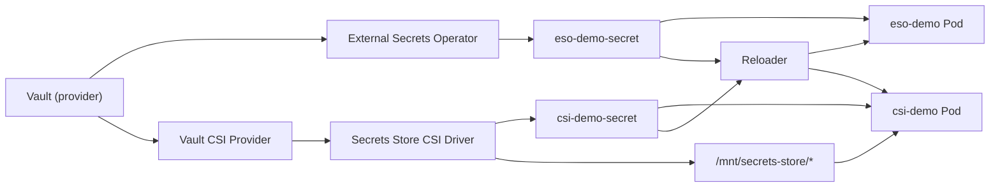

## Vault 架構圖

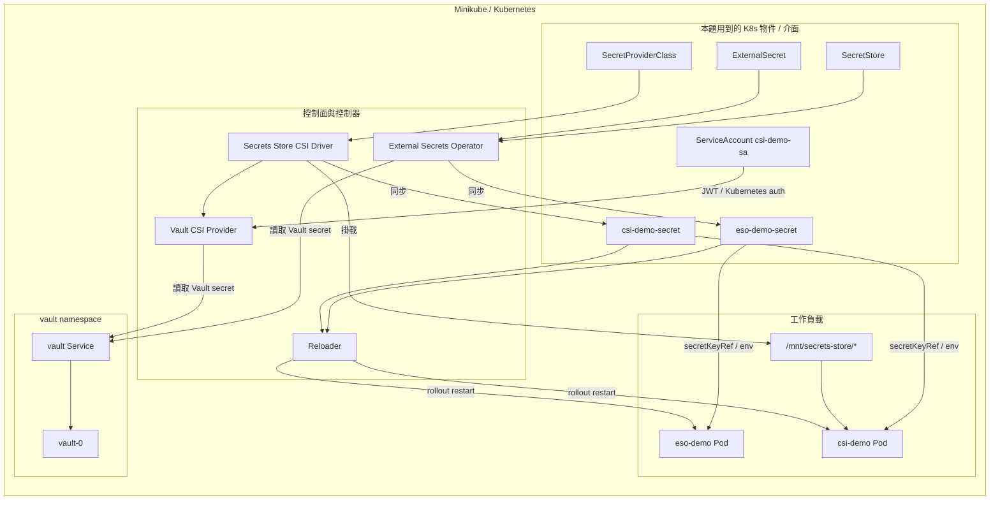

簡單說明：

- `Vault` 是這題唯一的 Secret Provider，ESO 和 CSI 兩條路線都從這裡取值。
- `External Secrets Operator` 透過 `SecretStore + ExternalSecret` 定期向 Vault 讀資料，再同步成 `eso-demo-secret`。
- `Secrets Store CSI Driver` 搭配 `Vault CSI Provider` 與 `SecretProviderClass`，把 Vault 內容掛進 Pod，也同步成 `csi-demo-secret`。
- `csi-demo-sa` 的 ServiceAccount token 會用來走 Vault 的 Kubernetes auth，讓 CSI 路線不用額外硬塞 Vault token 進 Pod。
- `Reloader` 會監看 `eso-demo-secret` 與 `csi-demo-secret`，一旦 Secret 內容變更，就幫對應 Deployment 做 rolling restart。
- 所以這題最後驗證的是兩件事：Secret 有沒有刷新，以及重啟後的新 Pod 有沒有真的讀到更新後的值。

## Repository 內容

- `vault/values-dev.yaml`
  Vault dev mode 與 Vault CSI provider 的 Helm values。
- `vault/eso-policy.hcl`
  ESO 專用唯讀 policy。
- `vault/csi-policy.hcl`
  CSI 專用唯讀 policy。
- `external-secrets/values.yaml`
  ESO Helm values（含 CRD 安裝）。
- `csi-driver/values.yaml`
  CSI Driver Helm values（開啟 sync secret 與 auto rotation）。
- `manifests/00-namespace.yaml`
  `week3-task11` namespace。
- `manifests/01-secretstore.yaml`
  ESO 使用的 `SecretStore`。
- `manifests/02-eso-demo.yaml`
  `ExternalSecret` 與 `eso-demo` Deployment。
- `manifests/03-csi-demo.yaml`
  `ServiceAccount`、`SecretProviderClass` 與 `csi-demo` Deployment。

## 實作重點

- `Vault` 這次用 dev mode，是為了本機 lab 可以快速重建與重跑；不適合 production。
- `ESO` 會定期把 Provider 內容同步到 Kubernetes Secret，但 Secret 更新本身不會讓 Pod 自動重啟，所以需要搭配 `Reloader`。
- `Secrets Store CSI Driver` 會把內容掛進 Pod，也可以同步成 Kubernetes Secret；根據官方文件，CSI Driver 本身不會重啟應用 Pod，所以同樣需要 `Reloader`。
- `vault-eso-token` 不應該把真實 token 寫死在 repo，因此改成用命令動態建立。
- 在 PowerShell 裡使用 `kubectl exec ... sh -c ".... $(cat ...) ..."` 時，`$(...)` 可能被 PowerShell 先展開；這次改成先把 token 抓進 PowerShell 變數，再塞進 `vault write` 指令。
- 這次 `minikube start` 曾出現 Docker network subnet 不足警告，但沒有阻塞安裝與驗證流程。

## 流程紀錄

### Step 0. 清理環境並確認乾淨基線

先把 `task1` profile 直接砍掉重建，確保沒有 Task10 留下來的 GitLab、Argo CD、Harbor、PVC 與 CRD 干擾。

```powershell
minikube delete -p task1
minikube start -p task1 --driver=docker
kubectl get ns
kubectl get pods -A
```

指令說明：

- `minikube delete -p task1`
  刪除舊的 `task1` profile，避免前一次 lab 殘留資源影響結果。
- `minikube start -p task1 --driver=docker`
  用 Docker driver 重新建立乾淨的 Minikube 叢集。
- `kubectl get ns`
  確認目前只剩預設 namespaces。
- `kubectl get pods -A`
  檢查所有系統 Pod 是否正常啟動。

代表意義：

- 這次驗證是從乾淨 cluster 開始
- 後面任何 Secret 同步或 Pod 重啟結果都比較好判讀

相關截圖：

- [01_clean_cluster_baseline.png](./01_clean_cluster_baseline.png)
  代表 Minikube 已重建完成，只剩預設 namespace 與系統 Pod。

  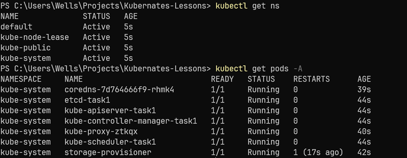

### Step 1. 確認 Helm 路徑並加入官方 Helm repo

這次環境中的 `helm` 不在 PATH，所以統一使用 repo 內的執行檔。

```powershell
$helm = Resolve-Path .\.tools\helm\helm.exe
& $helm version

& $helm repo add hashicorp https://helm.releases.hashicorp.com
& $helm repo add external-secrets https://charts.external-secrets.io
& $helm repo add secrets-store-csi-driver https://kubernetes-sigs.github.io/secrets-store-csi-driver/charts
& $helm repo add stakater https://stakater.github.io/stakater-charts
& $helm repo update
```

指令說明：

- `$helm = Resolve-Path .\.tools\helm\helm.exe`
  指向 repo 內的 Helm 執行檔，避免系統 PATH 裡找不到 `helm`。
- `& $helm version`
  確認 Helm 可用並記錄版本。
- `& $helm repo add hashicorp ...`
  加入 Vault 官方 Helm repo。
- `& $helm repo add external-secrets ...`
  加入 External Secrets 官方 Helm repo。
- `& $helm repo add secrets-store-csi-driver ...`
  加入 Secrets Store CSI Driver 官方 Helm repo。
- `& $helm repo add stakater ...`
  加入 Reloader 官方 Helm repo。
- `& $helm repo update`
  下載各 repo 的最新索引，讓後面可以安裝指定版本。

代表意義：

- 後面 Vault / ESO / CSI Driver / Reloader 都能用固定來源安裝
- 可把實際使用的 chart 版本寫回 README

### Step 2. 安裝 Vault 與 Vault CSI Provider

先把 Provider 本身裝進 cluster。這次使用 `week3/task11/vault/values-dev.yaml`，同時開啟 Vault CSI provider。

```powershell
$helm = Resolve-Path .\.tools\helm\helm.exe

& $helm upgrade --install vault hashicorp/vault `
  --namespace vault `
  --create-namespace `
  --version 0.32.0 `
  -f .\week3\task11\vault\values-dev.yaml

kubectl wait --for=condition=Ready pod -n vault --all --timeout=180s
kubectl get pods -n vault -o wide
kubectl get svc -n vault
```

指令說明：

- `& $helm upgrade --install vault ...`
  安裝或更新 Vault，並套用 `values-dev.yaml` 開啟 dev mode 與 Vault CSI provider。
- `kubectl wait --for=condition=Ready pod -n vault --all --timeout=180s`
  等 Vault namespace 內的 Pod 全部 Ready。
- `kubectl get pods -n vault -o wide`
  檢查 `vault-0` 與 `vault-csi-provider` 狀態。
- `kubectl get svc -n vault`
  確認 Vault Service 已建立完成。

代表意義：

- cluster 內已經有可用的 Vault server
- CSI 路線所需的 Vault provider 已跟著安裝完成

相關截圖：

- [02_vault_and_addons_ready.png](./02_vault_and_addons_ready.png)
  代表 Vault server 與 Vault CSI provider 已建立完成並進入可用狀態。

  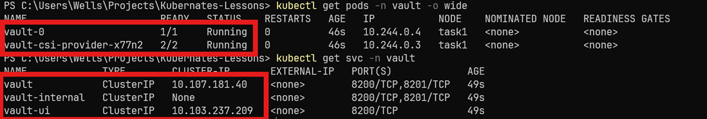

### Step 3. 安裝 External Secrets、Secrets Store CSI Driver 與 Reloader

```powershell
$helm = Resolve-Path .\.tools\helm\helm.exe

& $helm upgrade --install external-secrets external-secrets/external-secrets `
  --namespace external-secrets `
  --create-namespace `
  --version 2.2.0 `
  -f .\week3\task11\external-secrets\values.yaml

& $helm upgrade --install csi-secrets-store secrets-store-csi-driver/secrets-store-csi-driver `
  --namespace kube-system `
  --version 1.5.6 `
  -f .\week3\task11\csi-driver\values.yaml

& $helm upgrade --install reloader stakater/reloader `
  --namespace reloader `
  --create-namespace `
  --version 2.2.9

kubectl wait --for=condition=Ready pod -n external-secrets --all --timeout=180s
kubectl wait --for=condition=Ready pod -n reloader --all --timeout=180s
kubectl wait --for=condition=Ready pod -n kube-system -l app=secrets-store-csi-driver --timeout=180s
```

指令說明：

- `& $helm upgrade --install external-secrets ...`
  安裝 External Secrets Operator。
- `& $helm upgrade --install csi-secrets-store ...`
  安裝 Secrets Store CSI Driver。
- `& $helm upgrade --install reloader ...`
  安裝 Reloader，讓 Secret 更新後能觸發 Pod restart。
- `kubectl wait --for=condition=Ready pod -n external-secrets --all --timeout=180s`
  等 ESO 元件 Ready。
- `kubectl wait --for=condition=Ready pod -n reloader --all --timeout=180s`
  等 Reloader Ready。
- `kubectl wait --for=condition=Ready pod -n kube-system -l app=secrets-store-csi-driver --timeout=180s`
  等 CSI Driver DaemonSet Ready。

代表意義：

- `ESO` 路線與 `CSI` 路線的控制面都已就緒
- `Reloader` 已準備好觀察 Secret 變更並幫忙重啟 Pod

### Step 4. Bootstrap Vault：建立 secrets、policy、ESO token 與 Kubernetes auth

這一步是整題最關鍵的基礎設定。先建立 namespace，再把要給 ESO / CSI 讀的值寫進 Vault，然後配置兩條存取路線：

- ESO：透過 Vault token 讀 `secret/week3-task11/eso`
- CSI：透過 Kubernetes auth + Vault role 讀 `secret/week3-task11/csi`

```powershell
kubectl apply -f .\week3\task11\manifests\00-namespace.yaml

kubectl exec -n vault vault-0 -- sh -c "export VAULT_ADDR=http://127.0.0.1:8200 VAULT_TOKEN=root && vault kv put secret/week3-task11/eso username=eso-user password=InitialESO123 message=eso-v1"
kubectl exec -n vault vault-0 -- sh -c "export VAULT_ADDR=http://127.0.0.1:8200 VAULT_TOKEN=root && vault kv put secret/week3-task11/csi username=csi-user password=InitialCSI123 message=csi-v1"

kubectl cp .\week3\task11\vault\eso-policy.hcl vault/vault-0:/tmp/eso-policy.hcl
kubectl cp .\week3\task11\vault\csi-policy.hcl vault/vault-0:/tmp/csi-policy.hcl

kubectl exec -n vault vault-0 -- sh -c "export VAULT_ADDR=http://127.0.0.1:8200 VAULT_TOKEN=root && vault policy write eso-read /tmp/eso-policy.hcl && vault policy write csi-read /tmp/csi-policy.hcl"

$esoToken = (kubectl exec -n vault vault-0 -- sh -c "export VAULT_ADDR=http://127.0.0.1:8200 VAULT_TOKEN=root && vault token create -policy=eso-read -ttl=24h -field=token").Trim()
kubectl create secret generic vault-eso-token -n week3-task11 --from-literal=token=$esoToken

kubectl exec -n vault vault-0 -- sh -c "export VAULT_ADDR=http://127.0.0.1:8200 VAULT_TOKEN=root && vault auth enable kubernetes || true"

$reviewerToken = (kubectl exec -n vault vault-0 -- cat /var/run/secrets/kubernetes.io/serviceaccount/token).Trim()
kubectl exec -n vault vault-0 -- sh -c "export VAULT_ADDR=http://127.0.0.1:8200 VAULT_TOKEN=root && vault write auth/kubernetes/config token_reviewer_jwt='$reviewerToken' kubernetes_host='https://kubernetes.default.svc:443' kubernetes_ca_cert=@/var/run/secrets/kubernetes.io/serviceaccount/ca.crt disable_iss_validation=true"

kubectl exec -n vault vault-0 -- sh -c "export VAULT_ADDR=http://127.0.0.1:8200 VAULT_TOKEN=root && vault write auth/kubernetes/role/csi-demo bound_service_account_names=csi-demo-sa bound_service_account_namespaces=week3-task11 policies=csi-read ttl=24h"

kubectl exec -n vault vault-0 -- sh -c "export VAULT_ADDR=http://127.0.0.1:8200 VAULT_TOKEN=root && vault read auth/kubernetes/config"
```

指令說明：

- `kubectl apply -f .\week3\task11\manifests\00-namespace.yaml`
  建立本題專用 namespace `week3-task11`。
- `kubectl exec ... vault kv put secret/week3-task11/eso ...`
  在 Vault 中建立 ESO 路線要讀取的第一組 secret。
- `kubectl exec ... vault kv put secret/week3-task11/csi ...`
  在 Vault 中建立 CSI 路線要讀取的第二組 secret。
- `kubectl cp .\week3\task11\vault\eso-policy.hcl ...`
  把 ESO policy 檔案複製到 Vault Pod 內。
- `kubectl cp .\week3\task11\vault\csi-policy.hcl ...`
  把 CSI policy 檔案複製到 Vault Pod 內。
- `kubectl exec ... vault policy write eso-read ...`
  在 Vault 內建立 ESO 與 CSI 用的唯讀 policy。
- `$esoToken = (...)`
  動態產生 ESO 要用的 Vault token。
- `kubectl create secret generic vault-eso-token ...`
  把 ESO token 存成 Kubernetes Secret，讓 `SecretStore` 參考。
- `kubectl exec ... vault auth enable kubernetes || true`
  啟用 Vault 的 Kubernetes auth method。
- `$reviewerToken = (...)`
  從 Vault Pod 內取出 service account token，作為 Vault 驗證 Kubernetes JWT 的 reviewer token。
- `kubectl exec ... vault write auth/kubernetes/config ...`
  寫入 Vault 的 Kubernetes auth 設定，讓 CSI 路線可以用 service account 換取 Vault 權限。
- `kubectl exec ... vault write auth/kubernetes/role/csi-demo ...`
  建立 `csi-demo` 角色，允許 `csi-demo-sa` 讀取 CSI 那組 secret。
- `kubectl exec ... vault read auth/kubernetes/config`
  最後讀回設定，確認 Vault 的 Kubernetes auth 已配置完成。

代表意義：

- Vault 內的原始 secret 已建立
- ESO 與 CSI 各自都有合法的 Vault 存取路線
- `vault-eso-token` 是動態建立，不會把真實 token commit 進 repo

相關截圖：

- [03_vault_bootstrap_secrets_policies.png](./03_vault_bootstrap_secrets_policies.png)
  代表 Vault 內的 secrets、policy、ESO token 與 Kubernetes auth 都已配置完成。

  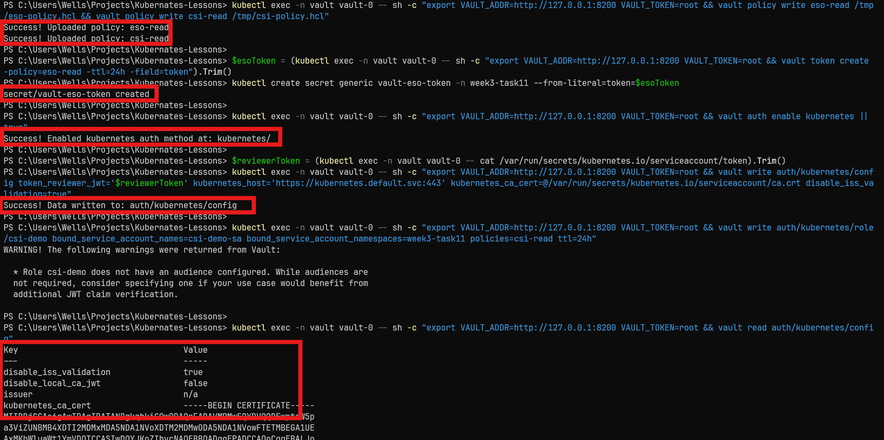

### Step 5. 套用 ESO 與 CSI demo manifests

```powershell
kubectl apply -f .\week3\task11\manifests\01-secretstore.yaml
kubectl apply -f .\week3\task11\manifests\02-eso-demo.yaml
kubectl apply -f .\week3\task11\manifests\03-csi-demo.yaml

kubectl get all -n week3-task11
kubectl get secret -n week3-task11
kubectl get secretproviderclasspodstatus -n week3-task11
```

指令說明：

- `kubectl apply -f .\week3\task11\manifests\01-secretstore.yaml`
  建立 ESO 對 Vault 的 `SecretStore` 連線設定。
- `kubectl apply -f .\week3\task11\manifests\02-eso-demo.yaml`
  建立 `ExternalSecret` 與 `eso-demo` Deployment。
- `kubectl apply -f .\week3\task11\manifests\03-csi-demo.yaml`
  建立 `ServiceAccount`、`SecretProviderClass` 與 `csi-demo` Deployment。
- `kubectl get all -n week3-task11`
  檢查兩個 demo 的 Pod / Deployment 是否都建立完成。
- `kubectl get secret -n week3-task11`
  確認 `eso-demo-secret` 與 `csi-demo-secret` 是否已同步出現。
- `kubectl get secretproviderclasspodstatus -n week3-task11`
  檢查 CSI Driver 是否已把 `SecretProviderClass` 套到 Pod 上。

代表意義：

- `SecretStore` 已把 ESO 對到 Vault
- `ExternalSecret` 與 `SecretProviderClass` 都已建立
- 兩個 demo Pod 都已開始消費來自 Vault 的值

### Step 6. 驗證第一次 Secret 同步成功（v1）

先看 Kubernetes Secret 是否真的被建立，再看 Pod 是不是真的讀到相同內容。

```powershell
$esoMsg = [Text.Encoding]::UTF8.GetString([Convert]::FromBase64String((kubectl get secret eso-demo-secret -n week3-task11 -o jsonpath="{.data.message}")))
$csiMsg = [Text.Encoding]::UTF8.GetString([Convert]::FromBase64String((kubectl get secret csi-demo-secret -n week3-task11 -o jsonpath="{.data.message}")))

$esoMsg
$csiMsg

kubectl logs -n week3-task11 deploy/eso-demo --tail=20
kubectl logs -n week3-task11 deploy/csi-demo --tail=20
```

指令說明：

- `$esoMsg = ...`
  取出並解碼 `eso-demo-secret` 的 `message` 欄位。
- `$csiMsg = ...`
  取出並解碼 `csi-demo-secret` 的 `message` 欄位。
- `$esoMsg`
  顯示 ESO 同步後的實際值。
- `$csiMsg`
  顯示 CSI 同步後的實際值。
- `kubectl logs -n week3-task11 deploy/eso-demo --tail=20`
  驗證 `eso-demo` Pod 是否已從 env 讀到 secret。
- `kubectl logs -n week3-task11 deploy/csi-demo --tail=20`
  驗證 `csi-demo` Pod 是否同時從 mount 與 synced secret 讀到值。

預期結果：

- `eso-demo-secret` 解碼後是 `eso-v1`
- `csi-demo-secret` 解碼後是 `csi-v1`
- `eso-demo` log 看到 `env message=eso-v1`
- `csi-demo` log 同時看到：
  - `mounted message=csi-v1`
  - `synced env message=csi-v1`

相關截圖：

- [04_eso_secret_synced_v1.png](./04_eso_secret_synced_v1.png)
  代表 ESO 已成功把 Vault 內容同步成 `eso-demo-secret`。

  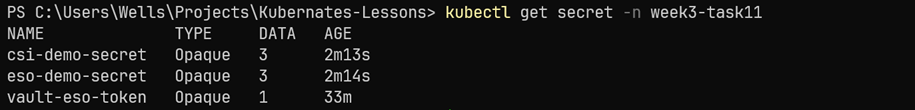

- [05_eso_pod_reads_v1.png](./05_eso_pod_reads_v1.png)
  代表 `eso-demo` Pod 已成功透過 env 讀到 `eso-v1`。

  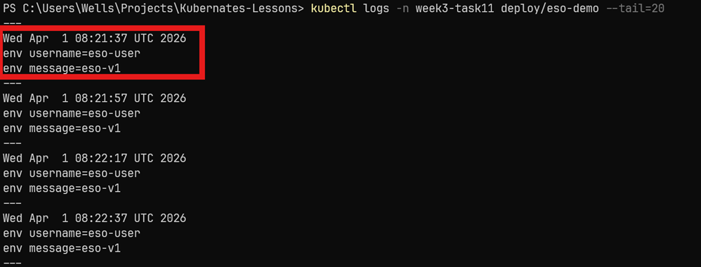

- [06_csi_secret_synced_v1.png](./06_csi_secret_synced_v1.png)
  代表 CSI Driver 已成功建立 `csi-demo-secret`，且 `SecretProviderClassPodStatus` 正常。

  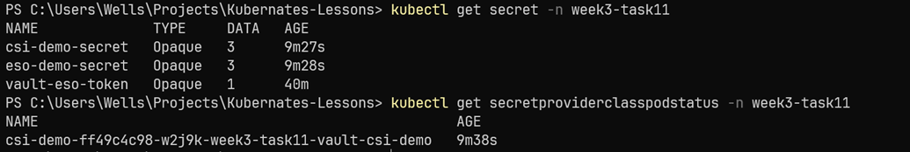

- [07_csi_pod_reads_v1.png](./07_csi_pod_reads_v1.png)
  代表 `csi-demo` Pod 已同時透過掛載檔案與 synced env 讀到 `csi-v1`。

  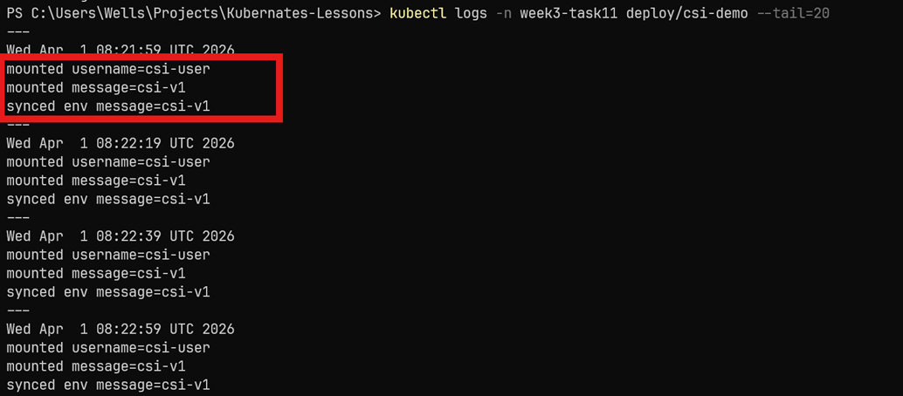

### Step 7. 更新 Secret Provider 內容（從 v1 轉成 v2）

直接改 Vault 裡的值，模擬 Provider 端秘密內容被輪替。

```powershell
$oldEsoPod = (kubectl get pod -n week3-task11 -l app=eso-demo -o jsonpath='{.items[0].metadata.name}').Trim()
$oldCsiPod = (kubectl get pod -n week3-task11 -l app=csi-demo -o jsonpath='{.items[0].metadata.name}').Trim()

kubectl exec -n vault vault-0 -- sh -c "export VAULT_ADDR=http://127.0.0.1:8200 VAULT_TOKEN=root && vault kv put secret/week3-task11/eso username=eso-user password=RotatedESO456 message=eso-v2"
kubectl exec -n vault vault-0 -- sh -c "export VAULT_ADDR=http://127.0.0.1:8200 VAULT_TOKEN=root && vault kv put secret/week3-task11/csi username=csi-user password=RotatedCSI456 message=csi-v2"
```

指令說明：

- `$oldEsoPod = ...`
  先記下更新前 `eso-demo` Pod 名稱，等等比對是否有 restart。
- `$oldCsiPod = ...`
  先記下更新前 `csi-demo` Pod 名稱。
- `kubectl exec ... vault kv put secret/week3-task11/eso ...`
  把 ESO 路線的 Vault secret 從 `v1` 更新成 `v2`。
- `kubectl exec ... vault kv put secret/week3-task11/csi ...`
  把 CSI 路線的 Vault secret 從 `v1` 更新成 `v2`。

代表意義：

- Provider 端的值確實已經改掉
- 下一步要觀察 ESO 與 CSI 是否把這個變更帶進 cluster

相關截圖：

- [08_vault_secret_rotated_v2.png](./08_vault_secret_rotated_v2.png)
  代表 Vault 內的兩組 secret 已從 `v1` 更新成 `v2`。

  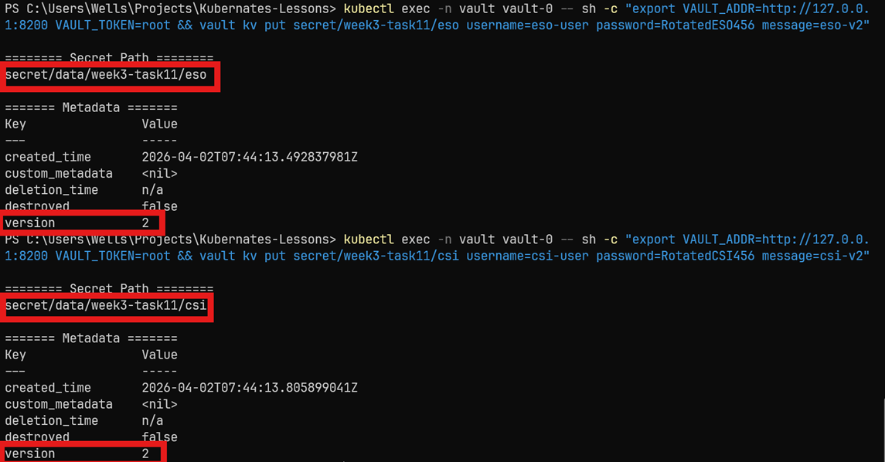

### Step 8. 驗證 Kubernetes Secret 已刷新成 v2

這一步先驗證 Secret 層真的變了，再看 Pod 是否也跟著更新。

```powershell
$esoMsg = [Text.Encoding]::UTF8.GetString([Convert]::FromBase64String((kubectl get secret eso-demo-secret -n week3-task11 -o jsonpath="{.data.message}")))
$csiMsg = [Text.Encoding]::UTF8.GetString([Convert]::FromBase64String((kubectl get secret csi-demo-secret -n week3-task11 -o jsonpath="{.data.message}")))

$esoMsg
$csiMsg
```

指令說明：

- `$esoMsg = ...`
  再次解碼 `eso-demo-secret`，確認 ESO 是否已把新值同步進 Kubernetes。
- `$csiMsg = ...`
  再次解碼 `csi-demo-secret`，確認 CSI 路線的 synced secret 是否已更新。
- `$esoMsg`
  顯示 ESO 更新後的實際值。
- `$csiMsg`
  顯示 CSI 更新後的實際值。

預期結果：

- `eso-demo-secret` 變成 `eso-v2`
- `csi-demo-secret` 變成 `csi-v2`

相關截圖：

- [09_synced_secrets_v2.png](./09_synced_secrets_v2.png)
  代表 ESO 與 CSI 兩邊同步出來的 Kubernetes Secret 都已刷新為 `v2`。

  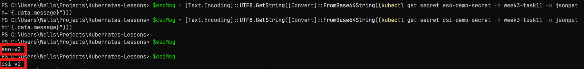

### Step 9. 驗證 Reloader 已觸發 Pod 重啟

Secret 更新不等於 Pod 自動重啟，所以這一步一定要看 Pod 名稱是否變了，以及 Reloader log 是否真的有紀錄。

```powershell
kubectl get pod -n week3-task11 -o wide
kubectl logs -n reloader deploy/reloader-reloader --tail=20
```

指令說明：

- `kubectl get pod -n week3-task11 -o wide`
  檢查兩個 Deployment 是否已經換成新的 Pod 名稱。
- `kubectl logs -n reloader deploy/reloader-reloader --tail=20`
  確認 Reloader 是否真的偵測到 Secret 變更並觸發更新。

預期結果：

- `eso-demo` 與 `csi-demo` pod 名稱都和更新前不同
- Reloader log 會看到：
  - `Changes detected in 'eso-demo-secret' ... updated 'eso-demo'`
  - `Changes detected in 'csi-demo-secret' ... updated 'csi-demo'`

相關截圖：

- [10_reloader_restarted_pods.png](./10_reloader_restarted_pods.png)
  代表兩個 Deployment 都已經因為 Secret 變更而被 Reloader 觸發重啟。

  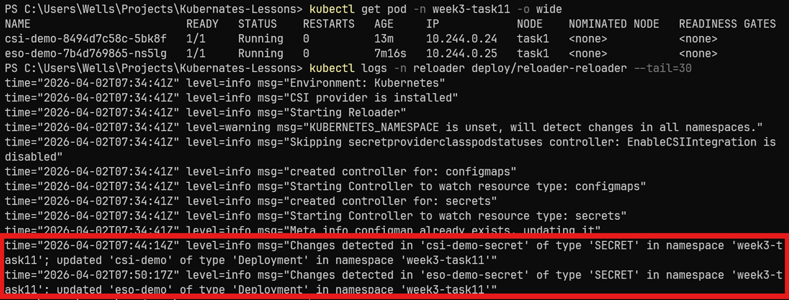

### Step 10. 驗證新 Pod 已讀到 v2

最後看新 Pod log，確認不是只有 Secret 更新，而是應用本身真的吃到新值。

```powershell
kubectl logs -n week3-task11 deploy/eso-demo --tail=20
kubectl logs -n week3-task11 deploy/csi-demo --tail=20
```

指令說明：

- `kubectl logs -n week3-task11 deploy/eso-demo --tail=20`
  確認重啟後的 `eso-demo` 已讀到 `eso-v2`。
- `kubectl logs -n week3-task11 deploy/csi-demo --tail=20`
  確認重啟後的 `csi-demo` 已讀到 `csi-v2`。

預期結果：

- `eso-demo` log 顯示 `env message=eso-v2`
- `csi-demo` log 顯示：
  - `mounted message=csi-v2`
  - `synced env message=csi-v2`

相關截圖：

- [11_pods_read_v2.png](./11_pods_read_v2.png)
  代表兩個新 Pod 都已成功讀到更新後的 `v2`。

  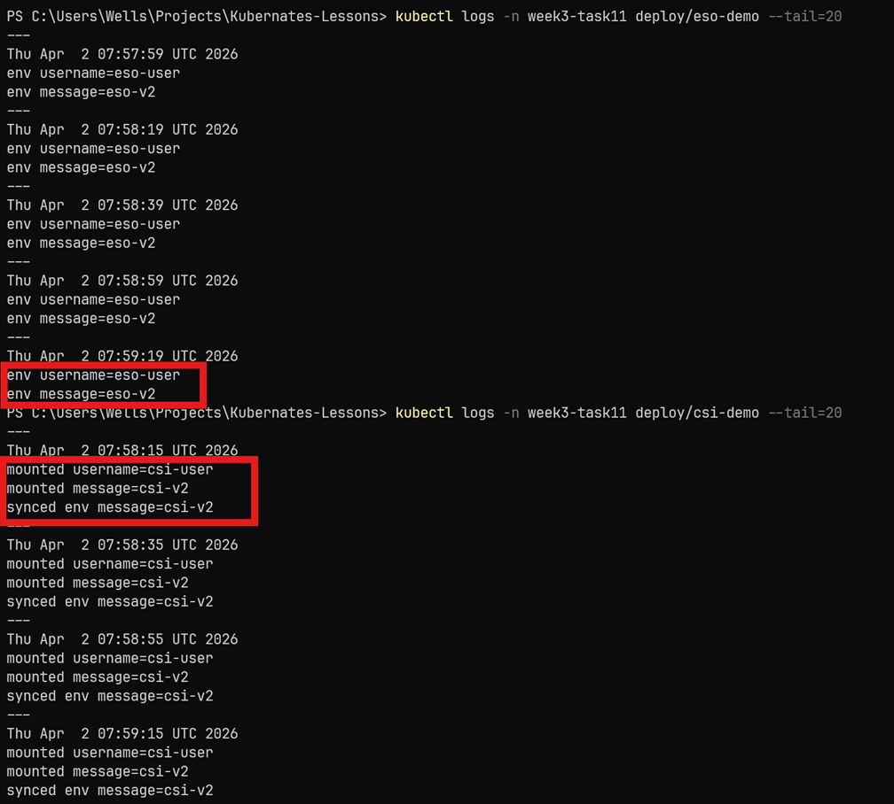

### Step 11. 最終狀態確認

```powershell
$helm = Resolve-Path .\.tools\helm\helm.exe

& $helm list -A
kubectl get ns
kubectl get pods -A
```

指令說明：

- `$helm = Resolve-Path .\.tools\helm\helm.exe`
  再次指向 repo 內的 Helm 執行檔。
- `& $helm list -A`
  列出所有 Helm releases，確認 Vault / ESO / CSI Driver / Reloader 都還在。
- `kubectl get ns`
  確認相關 namespaces 都存在。
- `kubectl get pods -A`
  檢查所有核心元件與 demo Pod 都維持正常。

代表意義：

- 四個核心元件（Vault / ESO / CSI Driver / Reloader）都穩定運作
- `week3-task11` 下的兩個 demo Pod 都已經在更新後維持正常

相關截圖：

- [12_final_cluster_state.png](./12_final_cluster_state.png)
  代表整套 week3/task11 環境已驗證完成且元件都正常運作。

  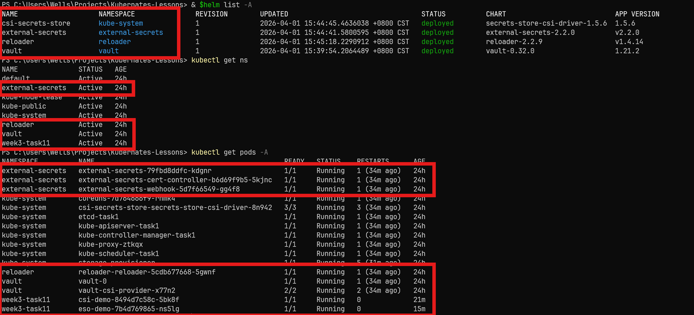

## 問題與修正摘要

### 1. `helm` 不在 PATH

原因：

- 目前主機環境不能直接輸入 `helm`

解法：

- 統一使用 repo 內的 `.\.tools\helm\helm.exe`

### 2. `minikube start` 出現 Docker network subnet 警告

現象：

- `failed to find free subnet for docker network task1`

結果：

- 這次沒有阻塞 cluster 建立，後續安裝與驗證仍成功完成

建議：

- 若之後真的卡住，再考慮清理 Docker networks；這次先記錄為非阻塞警告

### 3. PowerShell 會先展開 `$(...)`

現象：

- 原本想直接在 `kubectl exec ... sh -c` 內執行 `$(cat /var/run/.../token)`，結果被 PowerShell 搶先展開，導致路徑跑到 Windows 主機上

解法：

- 先用 PowerShell 把 reviewer token 抓進 `$reviewerToken`
- 再把變數值帶進 `vault write auth/kubernetes/config`

### 4. `vault-eso-token` 不該直接 commit 真實內容

原因：

- 這個 token 是執行期產物

解法：

- 在 README 中保留 `kubectl create secret generic vault-eso-token ...` 指令
- manifest 只保留 `SecretStore`，不把真實 token 寫進 repo

### 5. CSI Driver 會更新 mount / synced secret，但不會自己重啟 Pod

原因：

- 這是 CSI Driver 官方文件明確說明的行為

解法：

- 在 `csi-demo` Deployment 上加入 `secret.reloader.stakater.com/reload: "csi-demo-secret"`
- 讓 Reloader 在 `csi-demo-secret` 變更時觸發 Deployment 重啟

## 截圖索引

| 編號 | 檔名 | 在流程中的代表意義 |
| --- | --- | --- |
| 01 | `01_clean_cluster_baseline.png` | 乾淨 cluster 基線 |
| 02 | `02_vault_and_addons_ready.png` | Vault 與其 CSI provider 已就緒 |
| 03 | `03_vault_bootstrap_secrets_policies.png` | Vault secrets / policies / auth 已配置完成 |
| 04 | `04_eso_secret_synced_v1.png` | ESO 第一次同步成功 |
| 05 | `05_eso_pod_reads_v1.png` | ESO Pod 已讀到 `eso-v1` |
| 06 | `06_csi_secret_synced_v1.png` | CSI synced secret 與 SPC pod status 正常 |
| 07 | `07_csi_pod_reads_v1.png` | CSI Pod 已讀到 `csi-v1` |
| 08 | `08_vault_secret_rotated_v2.png` | Vault provider 內容已改成 `v2` |
| 09 | `09_synced_secrets_v2.png` | ESO / CSI 兩個 Kubernetes Secret 都已刷新成 `v2` |
| 10 | `10_reloader_restarted_pods.png` | Reloader 已觸發兩個 Deployment 重啟 |
| 11 | `11_pods_read_v2.png` | 新 Pod 已讀到 `v2` |
| 12 | `12_final_cluster_state.png` | 最終 cluster 狀態正常 |

## GitHub 上傳建議

建議至少把以下內容一起 commit：

- `week3/task11/README.md`
- `week3/task11/vault/*`
- `week3/task11/external-secrets/*`
- `week3/task11/csi-driver/*`
- `week3/task11/manifests/*`
- `week3/task11/*.png`（等你實際補完截圖後）

範例：

```powershell
git add .\week3\task11
git commit -m "Add week3 task11 Vault, ESO, and CSI driver demos"
git push
```

指令說明：

- `git add .\week3\task11`
  把 task11 的程式、README 與截圖加入版本控制。
- `git commit -m "..."`
  建立這次作業的 commit。
- `git push`
  推到遠端 GitHub repo。

## Cleanup

因為這題會安裝 cluster-scoped 元件與 CRD，最乾淨的清法是直接把 `task1` profile 刪掉：

```powershell
minikube delete -p task1
```

指令說明：

- `minikube delete -p task1`
  直接刪除整個 Minikube profile，回到最乾淨的狀態。

## 參考資料

- [External Secrets Operator](https://external-secrets.io/latest/)
- [ExternalSecret API](https://external-secrets.io/latest/api/externalsecret/)
- [Secrets Store CSI Driver](https://secrets-store-csi-driver.sigs.k8s.io/)
- [Sync as Kubernetes Secret](https://secrets-store-csi-driver.sigs.k8s.io/topics/sync-as-kubernetes-secret)
- [Secret Auto Rotation](https://secrets-store-csi-driver.sigs.k8s.io/topics/secret-auto-rotation)
- [Vault CSI Provider](https://developer.hashicorp.com/vault/docs/deploy/kubernetes/csi)
- [Run Vault on Kubernetes](https://developer.hashicorp.com/vault/docs/deploy/kubernetes/helm/run)
- [Reloader](https://github.com/stakater/Reloader)
